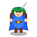
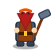
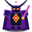
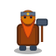

# ゲーム企画書（Game Design Document）

## 1. プロジェクト概要

| 項目 | 内容 |
|---|---|
| **ゲームタイトル（仮）** | **RogueLabyrinth（ローグラビリンス）** |
| **ジャンル** | 王道ターン制ダンジョン探索型ローグライクRPG（不思議のダンジョン系） |
| **プラットフォーム** | Webブラウザ（PC / スマートフォン・タブレット両対応） |
| **動作形態** | 完全オフライン動作 SPA（Single Page Application / PWA対応） |
| **対象層** | 手軽に本格的なローグライクを遊びたいプレイヤー、スキマ時間にじっくり思考型ゲームを楽しみたいユーザー |
| **画面比率** | レスポンシブ（PC横長、スマホ縦持ち・横持ちの全画面に追従） |

---

## 2. コンセプト & コア体験

### コンセプト
**「いつでも、どこでも、電波がなくても。1歩の選択が命運を分ける、手のひらの本格ローグライク」**

### プレイヤーに提供する体験
1. **純粋な戦略と思考の快感**
   - 「1歩動けば、敵も1歩動く」同時ターン制。反射神経やアクション操作は一切不要。
   - ピンチのときにアイテム袋を開き、「どのアイテムを切るか」を熟考して逆転するカタルシス。
2. **快適なマルチデバイス・レスポンシブ体験**
   - スマホの縦持ち片手操作でも、PCのテンキー/マウスでも、一切のストレスがない直感的な操作性。
3. **完全オフライン＆オートセーブによる安心感**
   - 通信環境を一切必要とせず、飛行機内や地下鉄でも完全に動作。
   - 1歩ごとに自動セーブされるため、ブラウザを突然閉じても中断したその瞬間の状態から復帰可能。

---

## 3. コアゲームループ

```
┌────────────────────────────────────────────────────────┐
│                   【1. 探索フェーズ】                   │
│   ・ランダム生成されたフロアを歩行・索敵              │
│   ・未探索エリアの霧（Fog of War）を晴らす             │
│   ・食料、武器、防具、巻物、杖、ポーションを拾う       │
└───────────────────────────┬────────────────────────────┘
                            │
                            ▼
┌────────────────────────────────────────────────────────┐
│                   【2. 交戦・危機フェーズ】             │
│   ・敵との遭遇、位置取り、距離の計算                  │
│   ・通常攻撃、遠距離アイテム、状態異常アイテムの行使   │
│   ・満腹度、HP、リソースの管理                        │
└───────────────────────────┬────────────────────────────┘
                            │
                            ▼
┌────────────────────────────────────────────────────────┐
│                 【3. 階段到達・階層突破】               │
│   ・次のフロアへ進む（難易度上昇、新たな敵・罠の出現）  │
│   ・深層のボス撃破、または秘宝を獲得して生還を目指す   │
└───────────────────────────┬────────────────────────────┘
                            │
                            ▼
┌────────────────────────────────────────────────────────┐
│                   【4. 結末（生還 / 死亡）】            │
│   ・死亡時: パーマデス（全アイテム・Lvロスト）         │
│   ・実績解除、プレイログ（スコア・到達階層）記録       │
│   ・新たな冒険へ（毎回変化するダンジョン）             │
└────────────────────────────────────────────────────────┘
```

---

## 4. ゲームシステム詳細

### 4.1. ターンシステム
- **同時ターン制**:
  - プレイヤーが「行動（移動、攻撃、アイテム使用、足踏み）」を完了すると、世界全体の時間が1ターン経過する。
  - フロア内の全モンスターが1回ずつ自律行動を行う。
- **行動優先順位**:
  1. プレイヤーのアクション
  2. プレイヤーのアクションに伴う効果（ダメージ判定、状態変化）
  3. 各モンスターの行動（プレイヤーへの接近、特殊行動、攻撃）
  4. ターン終了時処理（毒・リジェネ等の状態異常効果、満腹度消費、HP自然回復）

### 4.2. プレイヤーパラメータ＆計算式

#### プレイヤー初期ステータス
- **HP**: 15 / **最大HP**: 15
- **基礎攻撃力 (BaseAtk)**: 5 / **基礎防御力 (BaseDef)**: 2
- **総合攻撃力 (Atk)**: $\text{BaseAtk} + \text{武器値} + \text{武器強化値} + \text{腕輪補正}$
- **総合防御力 (Def)**: $\text{BaseDef} + \text{盾値} + \text{盾強化値}$
- **満腹度 (Hunger)**: 100 / **最大満腹度**: 100（歩行やターン経過で徐々に減少し、0で毎ターン1の餓死ダメージ）
- **レベル (Level)**: 1 / **累計経験値 (Exp)**: 0 / **次回必要経験値 (NextExp)**: 10
- **初期所持ゴールド**: 0 G
- **初期インベントリ枠**: 12枠（賭博仙人ガンジとのじゃんけんで最大20枠まで拡張可能）

#### レベルアップ成長計算式
$$\text{NextExp}_{n+1} = \text{round}(\text{NextExp}_n \times 1.8)$$
- レベルアップ時のステータス成長（毎レベル共通）:
  - **最大HP**: $+5$
  - **現在HP**: $+5$（※最大HP上昇分のみ回復し、緊張感のあるリソース管理を維持）
  - **基礎攻撃力**: $+2$
  - **基礎防御力**: $+1$

#### 戦闘ダメージ計算式

1. **プレイヤーからモンスターへの近接攻撃**:
   $$\text{Damage} = \max\left(1, \text{round}\left((\text{Atk}_{\text{player}} \times \text{variance} - \text{Def}_{\text{monster}}) \times \text{modifier}\right)\right)$$
   - 変動幅 $\text{variance}$: $0.85 \sim 1.15$ の一様乱数
   - 背後不意打ち時: $\text{modifier} \times 1.6$
   - 武器印【竜】ドラゴン特効: $\text{modifier} \times 1.5$（ドラゴン・アビスロード対象）
   - 武器印【聖】アンデッド特効: $\text{modifier} \times 1.5$（スケルトン・ゾンビ・亡霊・ミイラ対象）
   - 武器印【炎】紅蓮火炎: 基礎ダメージ $+4$
   - 武器印【会】会心の一撃（発動率35%）: $\text{modifier} \times 1.5$
   - 武器印【連】2回連続攻撃（発動率30%）: 最終ダメージ $\times 1.8$
   - **メタルスライム**: 上記計算に関わらず、被ダメージは常に **1**（会心または背後不意打ち時のみ **2**）に制限。

2. **モンスターからプレイヤーへの近接攻撃**:
   $$\text{Damage} = \max\left(1, \text{round}(\text{Atk}_{\text{monster}} \times \text{variance} - \text{Def}_{\text{player}})\right)$$
   - 盾印【避】見切り回避（発動率15%）: 攻撃を完全回避（$\text{Damage} = 0$）
   - 盾印【守】絶対防壁: 物理ダメージを20%カット（$\times 0.80$）
   - 盾印【竜防】竜耐性: ドラゴン・アビスロードからのダメージを50%半減（$\times 0.50$）

3. **仲間モンスターから敵モンスターへの援護攻撃**:
   $$\text{Damage} = \max\left(1, \text{round}(\text{Atk}_{\text{companion}} \times \text{variance} - \text{Def}_{\text{target}}) + \lfloor\text{Affection} / 5\rfloor\right)$$
   - メタルスライム相手の場合は常に **1**。
   - なかよし度（$\text{Affection}$）5ごとに $+1$ の追加確定ボーナスダメージ。

4. **遠隔飛び道具（矢・投擲アイテム）のダメージ**:
   $$\text{Damage} = \max\left(1, \text{round}((\text{Power} + \text{Atk}_{\text{player}} \times 0.35) \times (0.90 \sim 1.15) - \text{Def}_{\text{enemy}} \times 0.70)\right)$$
   - メタルスライム相手の場合は常に **1**。

---

### 4.3. ダンジョン生成ルール＆環境ギミック

- **マップ規格**: 横48 × 縦36セル（各セルは床、壁、水路等のタイル）。
- **BSP（二分空間分割法）アルゴリズム**:
  - 全体を再帰的に分割し、各部屋を1マス幅の通路（直線またはL字）で連結。孤立部屋が存在しないことを保証。
- **配置物生成ルール**:
  - **下り階段（`StairsDown`）**: スタート部屋とは別の最遠部屋に必ず1箇所生成。
  - **モンスター**: 1フロアあたり 4〜8体ランダム配置（階層スケーリング係数: $\text{scale} = 1 + (\text{Floor} - 1) \times 0.15$）。
  - **アイテム**: 1フロアあたり 4〜7個ランダム配置。
- **環境特殊タイル（足元ギミック）**:
  - **泥沼（Mud）**: 足を取られ、脱出移動時に40%の確率で足止め（1ターン消費＋約1.15秒もがきロック）。
  - **有毒沼（Poison）**: 踏むと有毒ガスによりHPに直接2ダメージ。
  - **氷床（Ice）**: 進入した方向へ障害物や壁に衝突するまでスーッと自動滑走。
- **フロア障害物（Obstacle）**:
  - **土の塊（DIRT_BLOCK）**: 攻撃2回で破壊。
  - **倒木・木塊（TREE_STUMP）**: 攻撃3回で破壊。
  - **雪の塊（SNOW_MOUND）**: 攻撃1回で破壊。
  - **押せる大石（PUSH_ROCK）**: 破壊不能。正面から2回押すと奥のマスへ地響きと共に移動（敵を挟み撃ち・ノックバック可能）。
  - **滑る氷塊（ICE_BLOCK）**: 正面から押すと直進滑走。壁や敵に衝突して粉砕し、衝突した敵に固定20ダメージ。

---

### 4.4. アイテム完全マスタ仕様（全46種）

ゲーム内に登場する全アイテムの完全パラメータ一覧です。
価格設定ルール：**買値（買入定価）**、**売値（買取価格） = $\lfloor\text{買値} \times 0.4\rfloor$**。

#### 1. 武器（Weapon）全9種
| 名称 | 基礎値 | 付与印 | 買値 | 売値 | 効果説明 |
| :--- | :---: | :---: | :---: | :---: | :--- |
| **青銅の短剣** | 2 | - | 80G | 32G | 取り回しの良い軽量な青銅短剣。攻撃力+2。 |
| **鉄の剣** | 4 | - | 150G | 60G | 鍛えられた片手剣。攻撃力+4。（25%で+1強化値付き） |
| **ミスリルの剣** | 7 | - | 350G | 140G | 神聖な銀白の魔導剣。攻撃力+7。（20%で+1強化値付き） |
| **ウォーハンマー** | 8 | - | 450G | 180G | 重厚な鉄塊で鍛えられた戦槌。攻撃力+8。 |
| **ドラゴンキラー** | 9 | `DRAGON` | 700G | 280G | ドラゴン系およびアビスロードに対しダメージ1.5倍特効。 |
| **炎の剣** | 10 | `FIRE` | 850G | 340G | 攻撃時に紅蓮の火炎爆発を起こし、追加+4ダメージ。 |
| **ホーリーランス** | 11 | `HOLY` | 1000G | 400G | アンデッド系モンスターに対しダメージ1.5倍特効。 |
| **ルーンの剣** | 12 | `DOUBLE` | 1300G | 520G | 30%の確率で電光石火の2回連続攻撃（1.8倍撃）が発動。 |
| **妖刀ムラマサ** | 15 | `CRITICAL` | 1800G | 720G | 35%の確率で必殺の会心の一撃（1.5倍撃）が発動。 |

#### 2. 盾（Shield）全8種
| 名称 | 基礎値 | 付与印 | 買値 | 売値 | 効果説明 |
| :--- | :---: | :---: | :---: | :---: | :--- |
| **木の盾** | 1 | - | 60G | 24G | 軽くて扱いやすい木製の丸盾。防御力+1。 |
| **青銅の盾** | 2 | - | 120G | 48G | 青銅で鍛造されたバックラー。防御力+2。 |
| **風の盾** | 3 | `EVASION` | 300G | 120G | 15%の確率で見切りの極意により敵の近接攻撃を完全回避。 |
| **鋼の盾** | 4 | - | 250G | 100G | 頑丈な銀鋼の盾。防御力+4。（25%で+1強化値付き） |
| **タワーシールド** | 5 | - | 400G | 160G | 全身を強固に防護する大盾。防御力+5。 |
| **魔法の盾** | 6 | `MAGIC_RESIST` | 650G | 260G | 遠隔魔法弾や店主セリアの雷撃ボルトの被ダメージを50%半減。 |
| **ドラゴンの盾** | 8 | `DRAGON_RESIST` | 900G | 360G | ドラゴン系・アビスロードからの攻撃・ブレスダメージを50%半減。 |
| **イージスの盾** | 10 | `DEFENSE_UP` | 1500G | 600G | 絶対防壁により、受けるすべての物理ダメージを20%カット。 |

#### 3. 腕輪・装飾品（Talisman）全3種
| 名称 | 基礎値 | 買値 | 売値 | 効果説明 |
| :--- | :---: | :---: | :---: | :--- |
| **ちからの腕輪** | 3 | 500G | 200G | 装備中、プレイヤーの総合攻撃力が常時+3上昇する。 |
| **遠見の腕輪** | 1 | 450G | 180G | 装備中、視界範囲が広がり敵の察知能力が向上する。 |
| **すり抜けの腕輪** | 1 | 600G | 240G | 装備中、身体が霊体化し敵の回避率が向上する。 |

#### 4. 飛び道具・矢（Arrow）全3種
| 名称 | 威力 | 束数 | 買値 | 売値 | 効果説明 |
| :--- | :---: | :---: | :---: | :---: | :--- |
| **木の矢** | 6 | 5〜15本 | 60G | 24G | 8方向に射出して遠距離敵を先制攻撃。床落ち矢は再回収可能。 |
| **鉄の矢** | 10 | 4〜10本 | 120G | 48G | 鋭利な鋼鉄の矢。高い威力を誇り、遠距離から大打撃を与える。 |
| **銀の矢** | 14 | 3〜6本 | 200G | 80G | 聖銀の光を纏い、直線上のすべての敵を無限貫通して薙ぎ払う。 |

#### 5. 魔法の杖（Staff）全6種
| 名称 | 威力/効果 | 使用回数 | 買値 | 売値 | 効果説明 |
| :--- | :---: | :---: | :---: | :---: | :--- |
| **吹き飛ばしの杖** | 5マスノックバック | 4〜6回 | 250G | 100G | 直線の敵を5マス後方へ吹き飛ばす。壁激突で10ダメージ。 |
| **場所替えの杖** | 位置スワップ | 4〜6回 | 200G | 80G | 命中したモンスターとプレイヤーの位置を瞬時に入れ替える。 |
| **かなしばりの杖** | 永続金縛り | 3〜5回 | 300G | 120G | 命中した敵を金縛りにし、攻撃を受けるまで完全に行動停止。 |
| **睡眠の杖** | 3〜6T睡眠 | 3〜5回 | 220G | 88G | 命中した敵を深い眠りに落とし、数ターンの間行動停止にする。 |
| **封印の杖** | 特殊能力封殺 | 3〜5回 | 280G | 112G | モンスターの特殊能力・遠距離魔法・分裂を完全に封じ込める。 |
| **雷鳴の杖** | 固定25ダメージ | 3〜5回 | 350G | 140G | 激しい電撃ビームを放ち、必中で固定25の大ダメージを与える。 |

#### 6. 草・霊薬（Potion）全8種
| 名称 | 効果値 | 買値 | 売値 | 効果説明 |
| :--- | :---: | :---: | :---: | :--- |
| **薬草** | 15回復 | 40G | 16G | 飲むとHPが15回復。アンデッドに投げ当てるとダメージ。 |
| **特薬草** | 35回復 | 90G | 36G | 飲むとHPが35大幅回復。 |
| **弟切草** | 100回復 | 200G | 80G | 飲むとHPが100超回復。アンデッドへの投擲で大打撃。 |
| **どくけし草** | 5回復 | 50G | 20G | HPを5回復し、毒状態を即座に治療・中和する。 |
| **命の草** | 最大HP+5 | 250G | 100G | 飲むと最大HPが永続的に+5上昇する。 |
| **すばやさの草** | 倍速10ターン | 180G | 72G | 飲むと10ターンの間、1ターンに2回連続行動が可能になる。 |
| **剛力の秘薬** | 基礎攻撃力+2 | 300G | 120G | 飲むと基礎攻撃力が永続的に+2上昇する。 |
| **復活の草** | HP全快蘇生 | 1000G | 400G | 所持しているだけで、HPが0になった瞬間に自動身代わり全快蘇生。 |

#### 7. 巻物（Scroll）全8種
| 名称 | 効果値 | 買値 | 売値 | 効果説明 |
| :--- | :---: | :---: | :---: | :--- |
| **天の恵みの巻物** | 武器強化+1 | 250G | 100G | 読むと装備中の武器を鍛錬し、強化値を永続的に+1引き上げる。 |
| **地の恵みの巻物** | 盾強化+1 | 250G | 100G | 読むと装備中の盾を鍛錬し、強化値を永続的に+1引き上げる。 |
| **真空斬りの巻物** | 部屋全体20ダメ | 220G | 88G | 読むと部屋内のすべての敵モンスターに20の大ダメージを与える。 |
| **ワープの巻物** | 瞬間移動 | 100G | 40G | 読むと同一フロア内のランダムな安全な部屋へ瞬間移動する。 |
| **雷の巻物** | 部屋全体30ダメ | 320G | 128G | 読むと部屋内に轟雷が炸裂し、すべての敵に30の雷撃ダメージ。 |
| **睡眠の巻物** | 部屋全体催眠 | 180G | 72G | 読むと部屋内のすべての敵モンスターを数ターン眠らせる。 |
| **混乱の巻物** | 部屋全体混乱 | 180G | 72G | 読むと部屋内のすべての敵を混乱させ、同士討ちを誘発する。 |
| **あかりの巻物** | マップ完全開示 | 150G | 60G | 読むとフロア全体の構造、階段、敵、アイテムが全て判明する。 |

#### 8. 食料（Food）全3種
| 名称 | 満腹度回復 | 買値 | 売値 | 効果説明 |
| :--- | :---: | :---: | :---: | :--- |
| **特製おにぎり** | 35%回復 | 50G | 20G | 海苔の香ばしいおにぎり。満腹度を35%回復。 |
| **大きなパン** | 60%回復 | 90G | 36G | ふっくら焼き上げたパン。満腹度を60%回復。 |
| **巨大なおにぎり** | 100%回復 | 150G | 60G | 米俵のような特大おにぎり。満腹度を100%完全回復。 |

#### 9. 壺（Pot）全1種
| 名称 | 容量 | 買値 | 売値 | 効果説明 |
| :--- | :---: | :---: | :---: | :--- |
| **合成の壺** | 3個 | 600G | 240G | 武器同士または盾同士を投入し、強化値を合算＆印（最大5個）を継承錬成する。 |

### 4.5. 状態異常と戦術インタラクション
- **金縛り（Paralysis）**: 敵が完全に石化・行動不能になる。攻撃を受けるまで永続。狭い通路の蓋や強敵の無力化に有効。
- **睡眠（Sleep）**: 数ターンの間行動停止。攻撃被弾で起床。
- **混乱（Confusion）**: ランダムな方向に突進・攻撃。同士討ちを誘発可能。
- **封印（Sealed）**: モンスターの特殊攻撃・分裂・遠距離射撃を完全封殺。通常攻撃のみにする。
- **倍速（Haste）**: プレイヤーが「すばやさの草」を服用すると10ターンの間、1ターンに2回連続行動が可能。
- **奇跡の即時蘇生**: インベントリに「復活の草」を所持していると、HPが0になった瞬間に草が身代わりとなって消費され、HP全快でその場で蘇生する。

### 4.6. ダンジョン内商人（ショップ・売買・泥棒システム）
ダンジョン深層（2F以降）にて確率で商人「ネロ」が営むフロア商店が出現する。
- **ゴールド通貨（Gold）**:
  - ダンジョン床にゴールドの山が生成される。拾うとインベントリ枠を消費せず直接所持金に加算される。
- **ショップの構造と陳列**:
  - ショップ部屋の床は高級ボルドー絨毯と金糸ステッチで飾られ、通常床と視覚的に明確に区別される。
  - 床には4〜6個の商品アイテムが並び、足元には買値バッジ（`[ ◯◯G ]`）が表示される。
  - 店内には店主ネロが常駐し、中立NPC（非攻撃的）としてプレイヤーを迎える。
- **購入フロー**:
  - 店内の商品を拾い上げると未会計品（`isShopItem: true`）としてインベントリに入る。
  - 店主ネロに話しかける（正面からインタラクトまたは移動衝突）と、未会計商品の合計額を提示され精算（購入）できる。
  - 未会計品を持ったまま部屋の出口に向かった場合、所持金が足りていれば自動で差引精算されて退店できる。所持金不足の場合は店主に呼び止められ、店外への移動が阻止される。
- **売却フロー**:
  - 自分の不要なアイテムを店内の絨毯の上に置く（足元に置く / 投げる等）と、店主による査定が行われ売却待ち（`isSoldToShop: true`）となる。足元には売値バッジ（`[ 売◯◯G ]`）が表示される。
  - 店主に話しかける、またはそのまま店外へ退出することで売却金が清算され所持金が加算される。
- **泥棒と番犬追撃システム**:
  - ワープの巻物や一時しのぎ等で精算を行わずに店外へ脱出した場合、**「泥棒警報！」**が発令される。
  - HUDに赤い警報バッジが点滅し、店主ネロは激怒状態（攻撃力999・超高耐久・倍速）へ変貌。
  - 瞬時に「番犬（ガードドッグ）」が店主の周囲に3頭召喚され、以後ターン経過で階段部屋や通路にも増援が出現する。
  - この極限状態の中、階段に到達して次フロアへ脱出（降りる）できれば「泥棒大成功」となり、未会計アイテムはすべて自分の物となる。

---

## 5. 階層構成とエンディングへの到達（50階層仕様）
本ダンジョンは全50階層のロングレンジ深層構造を持つ：
- **第1層〜第10層（石造迷宮）**: スライム、ゴブリン、スケルトン。基本ルールの習得。
- **第11層〜第20層（地下雪原・氷晶）**: コウモリ、亡霊、氷上スリップ床、押せる雪塊・氷塊。
- **第21層〜第30層（毒沼・泥濘の湿地）**: 泥濘足止め、ゾンビ、ミイラ、状態異常との戦い。
- **第31層〜第40層（灼熱の溶岩洞窟）**: インプ、ダークメイジ、レッドドラゴン。遠距離戦術と杖の活用が生命線。
- **第41層〜第49層（深層神殿・試練の回廊）**: 複合バイオーム、強化モンスターの群れ、凶悪な罠。
- **第50層（最深部・奈落の祭壇）**: 迷宮の支配者との最終決戦。撃破により「真のエンディング」と冒険の記録（スコア・討伐録）が解放される。

---

## 6. 操作体系・レスポンシブUI仕様

### 6.1. デバイス共通のアクション定義
ゲーム内のすべての入力は、内部的に以下の抽象アクション（`GameAction`）に変換される：
- `MOVE(dx, dy)`: 8方向への移動
- `ATTACK(dx, dy)`: 指定方向への攻撃
- `SHOOT`: 矢の8方向射出
- `ZAP_STAFF`: 魔法の杖の照射
- `THROW_ITEM`: アイテムの投擲
- `WAIT`: 足踏み（HP自然回復）
- `INTERACT`: 足元のアイテムを拾う / 階段を降りる
- `OPEN_INVENTORY`: 持ち物画面の開閉
- `USE_ITEM(slot, target)`: アイテムの使用・装備・投擲・配置

### 6.2. PC（デスクトップ）での操作
- **キーボード**:
  - 移動/攻撃: `テンキー(1-9)` / `WASD` + 斜めキー / `矢印キー`
  - 矢を撃つ（クイック射撃）: `F` または `Space`
  - 杖を振る（クイック杖照射）: `T` または `V`
  - 攻撃 / 調べる / 階段降り: `Enter` / `Z` / `J`
  - 足踏み（HP回復）: `テンキー 5` / `.` / 十字キー中央●
  - インベントリ開閉: `C` / `I` / `Tab`
  - ミニマップ表示切替: `M`（または画面上部マップボタン）
  - 斜め移動固定: `Shift` キー押しながら移動
- **マウス**:
  - マップ上の隣接セルクリック: 移動または攻撃
  - 離れたセルクリック: 自動最短経路歩行（A* Pathfinding）
  - 右クリック / 長押し: オブジェクト情報確認（インスペクト）

### 6.3. スマートフォンでの操作（縦持ち・横持ち対応）
- **オンスクリーン・コントロール**:
  - **画面左側 仮想十字キー（8方向パッド ＋ 中央足踏み●）**:
    - 外周8方向: 直感的な移動・向き変更（所持品中: アイテム上下選択）
    - 中央●ボタン: その場で1ターン足踏み（長押しで連続足踏み回復）
  - **画面右側 4ボタンクラスタ（Diamond配置）**:
    - **[A 攻撃 / 拾う（動的切替）]**: 正面の敵へ攻撃 / 階段降り。**足元にアイテムがある場合は自動的に「拾う」表記とゴールド発光（.btn-pickup）に切り替わり、最優先でアイテムを拾う**（所持品中: 使う / 装備）
    - **[B 撃つ]**: 装備中の矢を8方向へ射出。**矢を装備していない時はグレーアウト（.btn-disabled）表示**。装備時に鮮やかな赤色へ点灯し、残り本数を表示（例: `撃つ(12)`）。（所持品中: 閉じる）
    - **[Y 振る]**: 装備中の魔法の杖を正面へ照射。**杖を装備していない時はグレーアウト（.btn-disabled）表示**。装備時に鮮やかな琥珀色へ点灯し、残り回数を表示（例: `振る[5]`）。（所持品中: 整理整頓）
    - **[X 持物]**: 所持品一覧ダイアログを開く（所持品中: 選択中アイテムを投げる）
  - **所持品モーダルUX**:
    - 薬草・食料・巻物・投擲の使用時は、演出と結果メッセージを見るため**自動的にインベントリをクローズ**。
    - 武器・防具・腕輪に加えて**矢・杖の装備着脱時も、続けて他の装備の選定・試着ができるようインベントリを開いたまま維持**。インベントリ内でも `[E]` マークで装備状態が明示される。
- **ジェスチャー操作**:
  - スワイプ: その方向へ1歩移動/攻撃
  - ダブルタップ: その場足踏み
  - ピンチイン/アウト: マップ表示の拡大・縮小（ズーム）
  - マップドラッグ: カメラのスクロール（パン）
- **表示ズーム（拡大表示・カメラ設定）**:
  - **標準ズーム倍率: 150%（1.5倍）**: キャラクターやモンスターの細やかな表情・装備品・歩行ステップがはっきりと見え、マス目の中でも迫力あるサイズ感で表示されます。キャラクターの描画比率もマス目いっぱいの迫力サイズ（105%〜145%）に最適化。
  - **HUDズームボタン（`🔍 150%`）**: ヘッダーのボタンをクリック/タップすることで、100% → 150%（標準） → 200%（大迫力）と循環切り替え可能。
  - **直感的ズーム操作**: マウスホイールスクロール、PCキーボードの `+` / `-` キー、スマホの2本指ピンチイン/ピンチアウトによる0.8倍〜3.0倍の無段階ズームにも完全対応。
  - **設定の永続化**: 変更したズーム倍率は `localStorage`（キー: `rogue_camera_zoom`）に自動保存され、次回起動時も好みの倍率がシームレスに復元されます。
- **画面上部メッセージティッカー（2行表示カードUI）**:
  - 店主との会話セリフや泥棒発生時のアナウンス、フロアトラップ発動などの長文メッセージでも途中で省略されずに読み切れるよう、**最大2行の自動折り返し表示（`-webkit-line-clamp: 2`）**に対応。
  - スマホの画面幅に合わせてマージンを設けたモダンな角丸カードデザイン（`border-radius: 10px`、すりガラス `backdrop-filter: blur(8px)`、幅 `calc(100% - 24px)` 最大480px）。
  - 長文メッセージをしっかり読み切れるよう、自動フェードアウトまでの表示時間を従来の3.2秒から **4.5秒** に延長。
  - ダメージ（赤）、回復（緑）、情報（青）、警告（黄）、会話・特別イベント（金・アンバー枠）などメッセージ種別に応じた発光ボーダーと背景カラーで重要度を直感的に視認可能。
- **画面向きのレスポンシブ切り替え**:
  - **スマホ縦持ち（Portrait）**:
    - 上部（55%）: ダンジョンビュー（プレイヤー中心追従）
    - 下部（45%）: 操作パッド、ミニステータスバー、クイックアイテムスロット
  - **スマホ横持ち（Landscape）/ PC（Desktop）**:
    - 中央・左（70%）: ワイドダンジョンビュー
    - 右側（30%）: ステータスパネル、常時表示ログ、インベントリ一覧

---

## 7. アートスタイル & サウンド方針

### 7.1. ビジュアル
- クリーン＆レトロな **モダン・ベクターSVGスプライト**（高DPI・ピンチズームでも劣化ゼロ）。
- タイルマップ（壁、床、水路、氷床、泥濘、階段、障害物）とキャラクタースプライトをHTML5 Canvasで毎フレーム60fpsスムーズ補間描画。
- 視界外（Fog of War）は探索済みの減光処理＋未探索の暗黒処理。

### 7.2. サウンド（Web Audio APIによる完全オフラインSE生成）
外部のMP3/WAVファイルや通信を一切行わず、ブラウザ標準の `Web Audio API`（`AudioContext`, `OscillatorNode`, `BiquadFilterNode`, `GainNode`, ホワイトノイズバッファ）を用いて動的に物理的波形をプログラマティック生成します。

- **実装済み効果音一覧（高度物理合成Web Audio SE）**:
  - **武器種別・素手攻撃の差別化**:
    - **素手パンチ（殴打）**: 肉と骨が衝突する低音インパクト（90Hz→35Hz急降下三角波＋420Hz骨肉打撃ノイズ）。背後奇襲時は骨身に響く重低打撃。
    - **剣・刀剣（斬撃）**: 鋭利な刃先が空気を切り裂く鋭い高域バンドパス（2200Hz）＋急降下ノコギリ波スラッシュ音。
    - **槌・棍棒（重打撃）**: 重量級の鈍器が叩きつけられる破壊的ヘビーインパクト（140Hz→25Hz矩形波＋サブベース）。
    - **槍（刺突）**: 直線的に繰り出される鋭利な刺突インパルス（650Hz→110Hz）。
  - **空振り（素振り）**: 素手時は拳の風切り音（350Hz）、武器装備時は鋭い刃の風切り音（1600Hz）に自動分岐。
  - **弓矢・飛び道具**:
    - **発射**: 弓弦がピィンと弾ける弦鳴り（260Hz→750Hz）と矢の飛翔ノイズ。
    - **命中**: モンスターに突き刺さる鋭い打突音（280Hz→70Hz）。
    - **壁落下**: カランと床や壁に当たる落下音。
  - **魔法の杖（属性別照射）**:
    - **雷鳴の杖**: バリバリドォン！！と大気が裂ける轟雷・放電音。
    - **吹き飛ばしの杖**: ゴォォッ！と巻き起こる重厚な暴風・衝撃波ノイズ。
    - **かなしばりの杖**: キィーーン！と硬直させる高周波の氷結・結晶化音。
    - **睡眠・一時しのぎ・場所替えの杖**: ポワワ〜ン♪と幻想的に変調するマジックパルス音。
    - **光弾の杖**: ピシューンと空間を突き抜ける魔力光線音。
  - **アイテム投擲**: ひゅっと風を切る投擲音、およびモンスター命中時のクラッシュ音。
  - **スクーター走行・クラクション**:
    - **原付エンジン音**: トコトコトコ…ブルルルン！と鳴る単気筒4ストエンジンの排気パルス変調音。
    - **クラクション（ホーン）**: プッピー！と鳴るユーモラスな原付高音クラクション音。
  - **大石押しギミック**:
    - **1回目（肩当て・力み）**: ズズッ…ギギッ…と重みで軋む力み摩擦音。
    - **2回目（地響き移動）**: ゴゴゴゴッ……！と地面を震わせる超低周波重厚地響き音（移動マス数に応じた連続持続音）。
    - **大激突・圧殺**: ドガァァン！と壁やモンスターを押し潰す破壊的大激突音。
  - **環境ギミック音**:
    - **氷床滑走 / 氷上転倒**: スーーーッと滑る摩擦音 / ツルッ…ドテッ！と派手に尻もちをつく転倒音。
    - **泥濘足枷**: ズブズブ…！と足が深く沈み込みもがく泥沼音。
    - **障害物粉砕**: ガシャーン！バキィン！と木片や氷片が飛び散る破壊音。
  - **戦闘・システム共通**:
    - **プレイヤー被弾**: バンドパスノイズと重低音サイン波を組み合わせた骨太な打撃ショック音。
    - **モンスター被弾**: ピッチエンベロープによる肉弾ヒット音。
    - **アイテム拾得 / ゴールド拾得**: 明るい2音アルペジオ / 金貨のチャリン音。
    - **回復（薬草・妖精）**: 上昇する澄んだトライアングル和音。
    - **階段降り**: 深い地下へ潜るダンジョン下降音。
    - **レベルアップ**: 勝利の4和音上昇ファンファーレ。
    - **泥棒警報**: 店主の激怒と緊迫感を煽る警報サイレン音。
    - **お仕置きビンタ（平手打ち）**: バチィィン！と鋭く響く平手打ち・張り手音（1100Hz→120Hz急降下オシレータ＋バンドパス肉破裂ノイズ）。
    - **シャッター強制閉店**: ガラガラガラ……ガッシャーン！と連続して金属スラットが落ちて最後に重く接地する閉店音。
    - **力尽きる（敗北）**: 下降する重苦しいマイナーコード。
- **音量・ミュート制御**:
  - HUD上部の「🔊 SE: ON / 🔇 SE: OFF」ボタンによるワンクリック切替。
  - `localStorage`（キー: `rogue_sound_muted`）への設定永続化。
  - ブラウザの自動再生ポリシーに対応し、初回ユーザー操作時に安全に `AudioContext` をアンロック。

---

## 8. 変なレアキャラクター（特殊NPC / 癒やしモンスター / 迷い人）

ダンジョン第2層以降、極低確率でフロア内に出現する個性豊かなレアキャラクターです（第50層ボスフロアを除く）。

<div style="display: flex; gap: 16px; flex-wrap: wrap; margin-bottom: 20px;">
  <!-- さすらいの冒険者レオン -->
  <div style="background-color: #0f172a; border: 1px solid #3b82f6; border-radius: 12px; padding: 16px; text-align: center; width: 140px;">
    
    <div style="color: #60a5fa; font-weight: bold; font-size: 13px; margin-top: 6px;">冒険者レオン</div>
    <div style="color: #94a3b8; font-size: 11px;">物々交換 🎒</div>
  </div>

  <!-- 賭博仙人ガンジ -->
  <div style="background-color: #0f172a; border: 1px solid #a855f7; border-radius: 12px; padding: 16px; text-align: center; width: 140px;">
    
    <div style="color: #c084fc; font-weight: bold; font-size: 13px; margin-top: 6px;">賭博仙人ガンジ</div>
    <div style="color: #94a3b8; font-size: 11px;">じゃんけん 🎲</div>
  </div>

  <!-- 慈愛の妖精ピクシー -->
  <div style="background-color: #0f172a; border: 1px solid #10b981; border-radius: 12px; padding: 16px; text-align: center; width: 140px;">
    
    <div style="color: #34d399; font-weight: bold; font-size: 13px; margin-top: 6px;">妖精ピクシー</div>
    <div style="color: #94a3b8; font-size: 11px;">無差別癒やし 💖</div>
  </div>

  <!-- さすらいの鍛冶職人バルカン -->
  <div style="background-color: #0f172a; border: 1px solid #ea580c; border-radius: 12px; padding: 16px; text-align: center; width: 140px;">
    
    <div style="color: #fb923c; font-weight: bold; font-size: 13px; margin-top: 6px;">鍛冶職人バルカン</div>
    <div style="color: #94a3b8; font-size: 11px;">無料鍛錬 🔨</div>
  </div>

  <!-- スクーターおじさん -->
  <div style="background-color: #0f172a; border: 1px solid #ef4444; border-radius: 12px; padding: 16px; text-align: center; width: 140px;">
    
    <div style="color: #f87171; font-weight: bold; font-size: 13px; margin-top: 6px;">スクーターおじさん</div>
    <div style="color: #94a3b8; font-size: 11px;">横断・安全運転 🛵</div>
  </div>
</div>

1. **さすらいの冒険者レオン（WANDERING_ADVENTURER）** 🎒
   - **外見**: 鮮やかな青いマントと緑の羽帽子、大きなリュックを背負った旅の青年。
   - **機能**: **「物々交換」**。レオンが求めているカテゴリのアイテム（武器、盾、薬草、巻物、食料等）をプレイヤーが1つ渡すと、レオンが所持している上質・強化済みのアイテム（通常より1ランク上、階層に応じた強化値付き）と無償で交換してくれます。
2. **賭博仙人ガンジ（GAMBLER_SAGE）** 🎲
   - **外見**: 長い白髭、紫の道着、金の扇子とサイコロを携えた謎の老人。
   - **機能**: **「じゃんけん勝負」**。グー・チョキ・パーで勝負。
     - **勝ち**: プレイヤーの「道具の最大所持枠」を永続的に +2 枠拡張（最大24枠まで増加）。
     - **あいこ**: もう一度勝負（再挑戦）。
     - **負け**: 所持金500Gを没収（所持金が足りない場合はランダムな持ち物1つを没収）。
3. **慈愛の妖精ピクシー（HEALING_FAIRY）** 💖
   - **外見**: 透明な羽、ハートのステッキ、周囲にキラキラとした星粉を振りまく小型の妖精。
   - **機能**: **「敵味方無差別のおせっかい癒やし」**。
     - モンスター扱いでありながらプレイヤーを一切攻撃せず、プレイヤーが近づくと「HP +25」回復および「満腹度 +15%」を満たしてくれます。
     - ただし周囲にいる敵モンスターのHPも平等に回復させてしまうため、立ち回りによっては敵を援護してしまうユニークな特性を持ちます。
4. **さすらいの鍛冶職人バルカン（TRAVELING_BLACKSMITH）** 🔨
   - **外見**: 赤髭の屈強なドワーフ。革のエプロンと巨大な金槌を装備。
   - **機能**: **「武具の無料鍛錬」**。装備中の武器または盾を、叩いて +1〜+2 強化してくれます（1フロアにつき1回限定）。
5. **スクーターおじさん（SCOOTER_GUY）** 🛵
   - **外見**: クリーム色のジェットヘルメット、丸メガネ、ちょび髭、緑のジャンパーを着て、赤い原付スクーターに跨がった親しみやすいおじさん。
   - **挙動**: **脈絡なくダンジョンをトコトコと横断して去っていく**謎の存在。敵でも味方でもなく、プレイヤーやモンスターを攻撃することも敵対することもありません。
   - **特徴**:
     - 単気筒の軽快なエンジン音（ブルルルン…！）を響かせながらダンジョンの端から端へマイペースに走行。
     - 接触や話しかけると「おっと危ないよ若者！ 一時停止はちゃんと左右確認しなきゃダメだよ！」「ちょっとそこ通るよ〜。駅前のスーパーが特売日でねぇ」「制限速度は30km/h厳守！」など日常会話をして颯爽と去っていきます。
     - 攻撃を受けても動じず、モンスターもスクーターおじさんには道を譲ります。目標地点に到達すると「じゃあね〜！ 安全運転でね〜！」とクラクション（プッピー！）を鳴らしてダンジョン外へ去っていきます。

---

## 9. 武具合成・第50層ボス・真のエンディング（実装完了）

<div style="display: flex; gap: 16px; flex-wrap: wrap; margin-bottom: 20px;">
  <!-- 合成の壺 -->
  <div style="background-color: #082f49; border: 2px solid #06b6d4; border-radius: 12px; padding: 16px; text-align: center; width: 150px; box-shadow: 0 0 12px rgba(6,182,212,0.3);">
    
    <div style="color: #22d3ee; font-weight: bold; font-size: 13px; margin-top: 6px;">合成の壺</div>
    <div style="color: #67e8f9; font-size: 11px;">強化値合算 ＆ 印継承</div>
  </div>

  <!-- 奈落の魔王アビス・ロード -->
  <div style="background-color: #1e112a; border: 2px solid #a855f7; border-radius: 12px; padding: 16px; text-align: center; width: 150px; box-shadow: 0 0 16px rgba(168,85,247,0.3);">
    
    <div style="color: #c084fc; font-weight: bold; font-size: 13px; margin-top: 6px;">魔王アビス・ロード</div>
    <div style="color: #e879f9; font-size: 11px;">第50層 最深部ボス</div>
  </div>
</div>

- **合成の壺と印・ルーン継承システム**:
  - ベース武具と素材武具を選択して合成。強化値（+値）が合算され、素材武具の特殊能力印がベース武具の空きスロット（最大5枠）へ自動継承。
  - 【竜】竜特効、【炎】炎追加ダメージ、【聖】聖浄化、【連】2回攻撃、【会】会心率+25%、【竜耐】火炎半減、【魔】魔弾半減、【見】完全見切り回避15%、【防】被ダメ20%軽減の9大印が戦闘・被弾時に完全発動。
- **節目階層ストーリーモノローグ**:
  - 1F, 10F, 20F, 30F, 40F, 50F 初回到達時に、深淵迷宮『ラビリンス』の背景や魔王の脅威を語る重厚なストーリーモノローグが発火。
- **第50層ボス決戦「奈落の魔王アビス・ロード」**:
  - 最深部・第50層専用の大聖堂祭壇アリーナ（ALTARバイオーム）に君臨する巨大ボス。専用巨大SVGスプライト、グラデーションボスHPバー、遠距離火炎ブレスを放つ最強の支配者。
- **真のエンディング＆スタッフロール**:
  - ボス撃破により完全制覇判定となり、クリアボーナス+50,000点加算、真のエンディング演出、スタッフロール、および IndexedDB への最終ハイスコア永続記録が行われる。

---

## 10. 多種多様な名物店主たち（ショップNPCバリエーション）

ダンジョン内のショップには、従来の店主だけでなく、風来のシレン・トルネコの大冒険をはじめとする名作ローグライクへのリスペクトを込めた多彩な店主たちがランダムに店番として登場します。各店主ごとに専用のSVGスプライト、台詞、性格、怒りモードが実装されています。

<div style="display: flex; gap: 16px; flex-wrap: wrap; margin-bottom: 20px;">
  <!-- 大商人トルネー 通常 -->
  <div style="background-color: #0f172a; border: 1px solid #3b82f6; border-radius: 12px; padding: 14px; text-align: center; width: 130px;">
    
    <div style="color: #60a5fa; font-weight: bold; font-size: 12px; margin-top: 4px;">大商人トルネー</div>
    <div style="color: #94a3b8; font-size: 10px;">通常</div>
  </div>

  <!-- 大商人トルネー 激怒 -->
  <div style="background-color: #1e1111; border: 1px solid #ef4444; border-radius: 12px; padding: 14px; text-align: center; width: 130px;">
    
    <div style="color: #f87171; font-weight: bold; font-size: 12px; margin-top: 4px;">激怒トルネー</div>
    <div style="color: #ef4444; font-size: 10px;">パン投げ</div>
  </div>

  <!-- 風来坊シレンス 通常 -->
  <div style="background-color: #0f172a; border: 1px solid #0284c7; border-radius: 12px; padding: 14px; text-align: center; width: 130px;">
    
    <div style="color: #38bdf8; font-weight: bold; font-size: 12px; margin-top: 4px;">風来坊シレンス</div>
    <div style="color: #94a3b8; font-size: 10px;">通常</div>
  </div>

  <!-- 風来坊シレンス 激怒 -->
  <div style="background-color: #1e1111; border: 1px solid #dc2626; border-radius: 12px; padding: 14px; text-align: center; width: 130px;">
    
    <div style="color: #f87171; font-weight: bold; font-size: 12px; margin-top: 4px;">修羅シレンス</div>
    <div style="color: #dc2626; font-size: 10px;">真空波</div>
  </div>

  <!-- 鍛冶商人ゴルド 通常 -->
  <div style="background-color: #0f172a; border: 1px solid #d97706; border-radius: 12px; padding: 14px; text-align: center; width: 130px;">
    
    <div style="color: #fbbf24; font-weight: bold; font-size: 12px; margin-top: 4px;">鍛冶商人ゴルド</div>
    <div style="color: #94a3b8; font-size: 10px;">通常</div>
  </div>

  <!-- 鍛冶商人ゴルド 激怒 -->
  <div style="background-color: #1e1111; border: 1px solid #b91c1c; border-radius: 12px; padding: 14px; text-align: center; width: 130px;">
    
    <div style="color: #f87171; font-weight: bold; font-size: 12px; margin-top: 4px;">噴火親父ゴルド</div>
    <div style="color: #b91c1c; font-size: 10px;">鉄塊投げ</div>
  </div>

  <!-- 魔導商人セリア 通常 -->
  <div style="background-color: #0f172a; border: 1px solid #a855f7; border-radius: 12px; padding: 14px; text-align: center; width: 130px;">
    
    <div style="color: #c084fc; font-weight: bold; font-size: 12px; margin-top: 4px;">魔導商人セリア</div>
    <div style="color: #94a3b8; font-size: 10px;">通常</div>
  </div>

  <!-- 魔導商人セリア 激怒 -->
  <div style="background-color: #1e1111; border: 1px solid #9333ea; border-radius: 12px; padding: 14px; text-align: center; width: 130px;">
    
    <div style="color: #f87171; font-weight: bold; font-size: 12px; margin-top: 4px;">冷徹魔女セリア</div>
    <div style="color: #9333ea; font-size: 10px;">雷撃ボルト</div>
  </div>

  <!-- 元祖商人ネロ 通常 -->
  <div style="background-color: #0f172a; border: 1px solid #eab308; border-radius: 12px; padding: 14px; text-align: center; width: 130px;">
    
    <div style="color: #facc15; font-weight: bold; font-size: 12px; margin-top: 4px;">商人ネロ</div>
    <div style="color: #94a3b8; font-size: 10px;">通常</div>
  </div>

  <!-- 元祖商人ネロ 激怒 -->
  <div style="background-color: #1e1111; border: 1px solid #ef4444; border-radius: 12px; padding: 14px; text-align: center; width: 130px;">
    
    <div style="color: #f87171; font-weight: bold; font-size: 12px; margin-top: 4px;">怒りの店主ネロ</div>
    <div style="color: #ef4444; font-size: 10px;">包丁投げ</div>
  </div>
</div>

1. **大商人トルネー（TORNEKO風）**
   - **外見**: 青いターバン頭巾、赤白ストライプのゆったり服、青いマント、大きな福耳、立派なカイゼル髭、抱えた大袋。
   - **性格**: 人懐っこく温厚な商人気質。「毎度あり！わしは世界一の武器商人を目指しておるんじゃ。良い品が揃っておるよ、ゆっくり見ていっておくれ！」
   - **泥棒時**: 「わ、わしの店で泥棒じゃとーーっ！？ 冒険者の風上にも置けん奴め！ 番犬ども、全財産を奪い返せーーっ！！」と怒髪天で大袋を振り回して追跡。
2. **風来坊シレンス（SHIREN風）**
   - **外見**: 竹編みの三度笠、青白の縞合羽、旅の帯と刀、精悍な若武者の目元、肩に乗った黄色い相棒の小動物。
   - **性格**: クールで寡黙だが義理堅い。「……いらっしゃい。旅の備えなら揃っている。命を大事にしな。」
   - **泥棒時**: 「……泥棒か。迷宮の掟を破ったな。逃げ切れると思うなよ……！」と抜き身の名刀を青白く光らせて迫る修羅と化す。
3. **鍛冶商人ゴルド（ドワーフ）**
   - **外見**: 褐色の肌、豊かな赤茶の髭、革エプロン、鍛冶屋の大槌（ハンマー）。
   - **性格**: 豪快で一本気な鍛冶親父。「おう！冷やかしなら帰んな！俺が鍛え上げた業物ばかりだ、じっくり品定めしな！」
   - **泥棒時**: 「俺の目の前でタダ持ち出しだとぉ！？ 許さねえ！ ハンマーで叩き潰して鉄屑にしてやるわい！！」と赤熱ハンマーを振り上げて追撃。
4. **魔導商人セリア（エルフ）**
   - **外見**: 金髪ロングウェーブ、尖ったエルフ耳、紫の魔道シルクローブ、宙に浮く水晶玉。
   - **性格**: 優雅で魅惑的なエルフの魔女。「あら、ようこそ迷宮の迷い子さん。ふふ、何をお探し？ 深層は危険よ、しっかり準備なさいな。」
   - **泥棒時**: 「あらあら……私の店で泥棒？ 身の程知らずな子ね。逃げられると思ったら大間違いよ、灰にしてあげるわ！」と瞳を真紅に光らせ紫電魔法陣を展開。
5. **元祖商人ネロ**
   - **外見**: 黄色いターバン、緑の服、赤いベストの標準的商人。
   - **性格**: 「毎度どうも！ごゆっくり見ていっておくれよ！」
   - **泥棒時**: 「泥棒だーーーっ！！ 番犬ども、あいつを絶対に逃すなーーっ！！」

### 10.1. しつこい連続接触・冷やかしペナルティ
未会計の商品を持たず、売却希望アイテムも床に置いていない状態で店主に何度も連続して接触・話しかけた場合、店主の態度が段階的に変化します。
1. **1〜2回目（通常接客）**:
   - 各店主の通常の元気な挨拶メッセージ。
2. **3〜4回目（困惑・冷やかし警告）**:
   - 「何かお探しですかな？ 冷やかしなら困るんじゃが…」（トルネー）
   - 「……用がないなら、静かに商品を見てくれ。」（シレンス）
   - 「おいおい！ 何度もつついてどうした！？ 買うもんねえなら邪魔だぜ！」（ゴルド）
   - 「ふふ、私の顔に何かついてるかしら？ 見惚れるのもいいけれど、お買い物はどう？」（セリア）
   - 「お客さん、何か用かい？ 冷やかしはお断りだよ！」（ネロ）
3. **5〜6回目（激怒寸前・最後通告）**:
   - 「これこれ若者！ しつこいぞ！ これ以上からかったら怒るぞい！」（トルネー）
   - 「……何度も同じことを言わせるな。次はないぞ。」（シレンス）
   - 「おい貴様！ 俺の仕事の邪魔をするな！ ハンマーが唸るぞ！」（ゴルド）
   - 「あら……私を怒らせたいのかしら？ 後悔することになるわよ？」（セリア）
   - 「いい加減にしな！ これ以上しつこくしたらタダじゃ置かないよ！」（ネロ）
4. **7回目以上（お仕置きビンタ or シャッター強制閉店）**:
   - **50%の確率でお仕置きビンタ**:
     - 専用平手打ちSE（`playSlap`）とともに、店主から強烈な張り手・ビンタを食らい、8ダメージ＋1マス後退ノックバックが発生！
     - トルネー「もう我慢ならんわい！ 塩でも食らえーーっ！！」
     - シレンス「……警告はしたはずだ。（パシィン！ 鞘の峰打ち！）」
     - ゴルド「てめえ！ 脳天にゲンコツ食らわしてやるわい！！」
     - セリア「しつこい男は嫌いよ。（バチチッ！ 静電気ショック！）」
     - ネロ「出て行けーーーーっ！！（ドゴォッ！ ほうきで叩き出された！）」
   - **50%の確率でシャッター強制閉店**:
     - 専用シャッターガラガラSE（`playShutterClose`）が鳴り響き、店主は床に並べてある未購入商品を瞬時に全回収して片付け、シャッターを下ろして営業を終了（`isShopClosed: true`）。
     - 以降、店主に話しかけても「本日の営業は終了しました。またのお越しをお待ちしております。（シャッターが固く閉ざされている……）」となり、そのフロアでは一切の買い物が不可能となります。

### 10.2. 泥棒逃走中の店主による遠距離追撃
未会計の商品を所持したまま店外へ脱出すると、店主は怒髪天の「激怒モード」（HP 350, ATK 65, DEF 25）に変貌し、番犬警備隊を引き連れて高速追撃を開始します。
さらに、店主と直線または斜めの射線が通った距離2〜5マスの位置にプレイヤーがいる場合、**毎ターン50%の確率で店主固有の強烈な遠隔追撃攻撃**を繰り出してきます。
- **大商人トルネー**: **【巨大フランスパン投げ】**（ダメージ: 14 / 投擲SE / ITEM飛翔体）「泥棒ーーっ！ そいつを返せーーっ！」と頑丈な特大フランスパンを力任せに投げつけてくる。
- **風来坊シレンス**: **【飛剣の真空波】**（ダメージ: 16 / 斬撃SE / BEAM飛翔体）「逃がさん……！」と抜き放った名刀から鋭利な青い真空の刃を放つ。
- **鍛冶商人ゴルド**: **【鉄塊投げ】**（ダメージ: 18 / 槌打撃SE / STONE飛翔体）「逃げるたぁいい度胸だ！」と赤熱した重い鉄塊をドカンと投擲してくる。
- **魔導商人セリア**: **【紫電の雷撃ボルト】**（ダメージ: 16 / 轟雷SE / BEAM飛翔体）「ふふ、逃げられるかしら？」と紫電の魔弾を撃ち込んでくる（魔法の盾【魔】の印で半減可能）。
- **商人ネロ**: **【包丁投げ】**（ダメージ: 14 / 投擲SE / ARROW飛翔体）「この泥棒猫め！」と目にも留まらぬ速さで銀の包丁を投げてくる。

---

## 11. SVG動的カラーパレットスワップ＆極稀な仲間モンスターシステム

### 11.1. SVGカラーパレットスワップによるモンスターバリエーション
画像アセットファイルを追加することなく（メモリおよび通信容量の増加ゼロ）、テキストベースのSVGデータ内のカラーコードを動的に置換する技術により、**12種以上の色違い・上位種モンスター（各5方向）**を動的生成・配置しています。
- **メタルスライム**: 極低確率でスポーン。防御力が極めて高く受けるダメージが常に1（会心時2）。プレイヤーから素早く逃走するAIを持ち、討伐で120 EXPを獲得。
- **上位種モンスター**: ポイズンスケルトン（毒浸食追加ダメージ）、カオスバット（怪音波による向き強制転換）、ブラッドスケルトン（与ダメージの40%吸血回復）、ゴブリンシャーマン（遠隔闇弾）など、種族ごとの特徴的な能力で中深層の緊張感を創出。

### 11.2. 極稀な仲良し仲間モンスターシステム（Companion System）
約2.5%の極稀な確率で、プレイヤーを攻撃せず最初から仲良くしたがる仲間モンスター（例: 「人なつっこいスライム」「心優しいゴブリン」）が出現します。
1. **頭上💖エモートバッジ**: 愛らしいピンクのハートが常時脈動表示され、一目で仲間と識別可能。
2. **位置スワップ機能（通路スタック防止）**: 狭いダンジョン通路で進路を塞ぐことがないよう、プレイヤーが仲間モンスターへ移動バンプすると攻撃せずに位置を相互に入れ替えます。
3. **なかよし度と癒やし回復**: 位置スワップや触れ合いでなかよし度が増加し、一定確率でプレイヤーのHPを回復（+3〜6HP）してくれます。
4. **自律援護戦闘**: 周囲5マスの敵モンスターを索敵し、近接攻撃で勇敢に戦います。敵を撃破した場合はプレイヤーに討伐経験値が満額還元されます。
5. **深層フロアへの同伴**: 階段を降りる際、生存している仲間モンスターは次の階層へ一緒に駆け下りて連行され、長旅を共にすることができます。

---

## 12. モバイル・レスポンシブUX強化仕様

### 12.1. キャラクター表示の150%標準拡大
スマートフォン等の小型画面でも主人公やモンスターの表情・装備・モーションが明瞭に視認できるよう、キャラクターの描画サイズを標準の**150%（`scale = 1.5`）**に拡大。足元のグリッド感と重厚なキャラクター実在感を両立しています。

### 12.2. スマホ上部メッセージログの2行表示エリア確保
スマホ縦持ちプレイ時、緊迫した戦闘ログやアイテム効果、NPCのセリフが1行だけで見切れてしまう問題を解消するため、画面上部のメッセージ表示エリアを**2行分常時確保**。直近の重要ログを瞬時に把握できる設計としています。

### 12.3. PWA / Service Worker の多層キャッシュバスティング
スマートフォンのブラウザ（FirefoxやSafari等）において、キャッシュが過剰に保持されて画面が固まる現象を防ぐため、ビルド時にService Workerへユニークなタイムスタンプバージョンを自動注入。更新検知時には既存の旧キャッシュを瞬時に全破棄し、常に最新のコードで即座に動作する堅牢なオフラインPWA基盤を構築しています。


