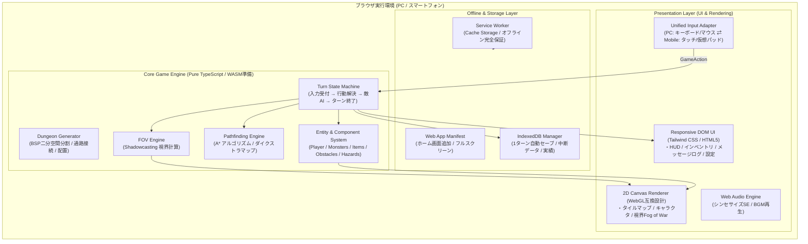
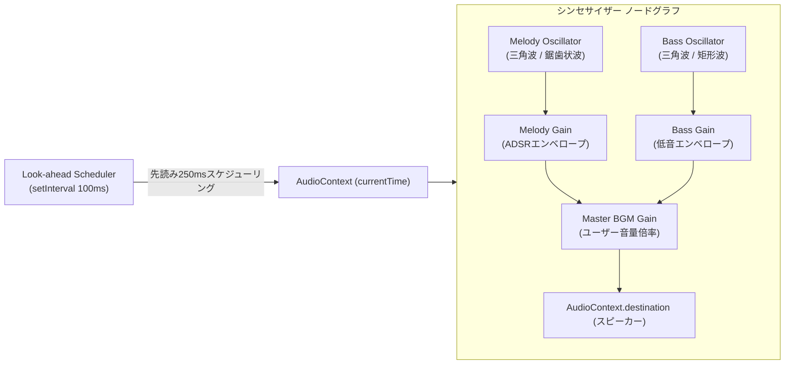
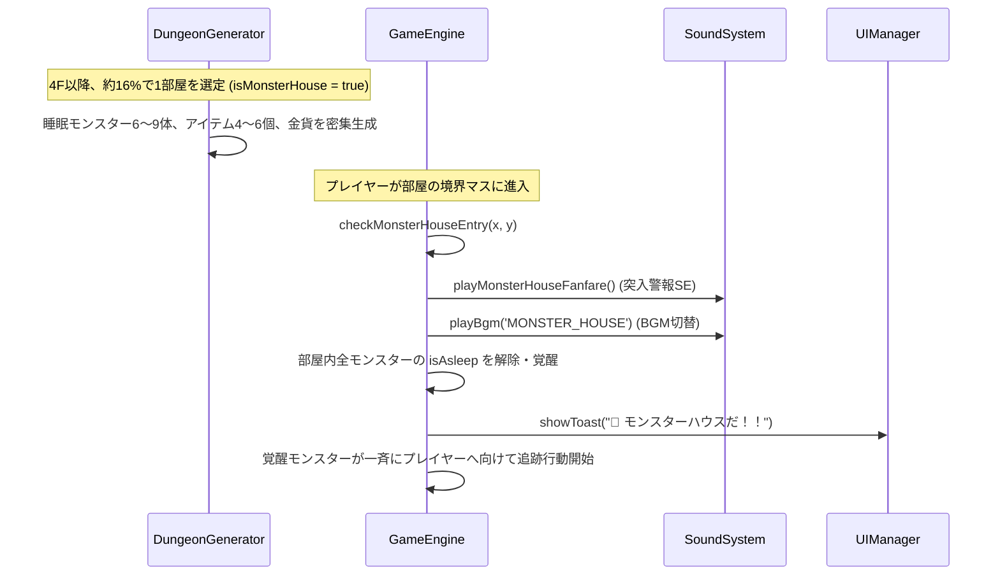

# システムアーキテクチャ設計書（Architecture & Technical Specification）

## 1. 全体アーキテクチャ

本システムは、**完全オフラインで動作するシングルページアプリケーション（SPA）** であり、プログレッシブウェブアプリ（PWA）としてネイティブアプリ同等の体験を提供します。



---

## 2. ディレクトリ構造

拡張性と保守性を重視した、クリーンなレイヤードアーキテクチャを採用します。

```text
WebGame01/
├── docs/                             # 仕様書・設計書・コーディング規約
│   ├── 01_game_design.md             # ゲーム企画書・詳細仕様・アイテムマスタ
│   ├── 02_architecture.md            # システムアーキテクチャ・モジュール構造
│   ├── 03_roadmap.md                 # 開発ロードマップ・マイルストーン
│   ├── 04_characters.md              # キャラクター・モンスター完全仕様・SVG一覧
│   ├── 05_title_and_scores.md        # タイトル画面・スコア計算・ハイスコア履歴
│   ├── 06_biomes_and_floors.md       # バイオーム・フロア構成・決定ボタン優先度
│   └── 07_coding_standards.md        # コーディング規約（TypeDocコメント基準）
├── public/                           # 静的Web公開アセット
│   ├── favicon.ico
│   ├── manifest.json                 # PWA Web App Manifest
│   ├── sw.js                         # Service Worker（ビルド時にバージョン注入）
│   └── icons/                        # PWAアプリアイコン群 (192x192, 512x512)
├── src/
│   ├── main.ts                       # アプリケーション初期化エントリーポイント
│   ├── style.css                     # レスポンシブレイアウト・Tailwindスタイル定義
│   ├── audio/
│   │   └── SoundSystem.ts            # Web Audio API シンセサイズ物理音響システム（全SE生成）
│   ├── core/                         # コアゲームロジック（DOM非依存・ヘッドレス可能）
│   │   ├── GameEngine.ts             # ゲーム全体のファサード・ターン進行・状態遷移
│   │   ├── types.ts                  # 共通型定義（Player, Monster, Item, ActionType等）
│   │   ├── compendiumData.ts         # 迷宮博物誌（全魔物・全名品）マスタ定義
│   │   ├── algorithms/
│   │   │   ├── DungeonGenerator.ts   # BSP空間分割・部屋・通路・特殊バイオーム生成
│   │   │   ├── FOV.ts                # 再帰的シャドウキャスティング視界計算
│   │   │   └── Pathfinding.ts        # A* 経路探索アルゴリズム
│   │   ├── entities/
│   │   │   └── EntityFactory.ts      # モンスター・アイテム・障害物のパラメータ生成ファクトリ
│   │   └── systems/
│   │       ├── CombatSystem.ts       # プレイヤー/敵/仲間間の戦闘ダメージ・命中・レベル計算
│   │       ├── ItemSystem.ts         # アイテム使用・拾得・投擲・矢射出・杖照射判定
│   │       ├── NpcSystem.ts          # レア中立NPC（レオン・ガンジ・ピクシー・バルカン）会話イベント
│   │       ├── ShopSystem.ts         # 商店売買精算・泥棒判定・店主冷やかし＆遠隔追撃AI
│   │       └── SynthesisSystem.ts    # 合成の壺による武具強化値合算＆印継承錬成
│   ├── input/
│   │   └── InputManager.ts           # キーボード・タッチ・仮想十字キー・マウスクリック統合
│   ├── render/                       # 描画・アニメーションレイヤー
│   │   ├── CanvasRenderer.ts         # Canvas 2D 描画（カメラ追従・タイル・キャラ・Fog of War）
│   │   ├── AnimationEngine.ts        # 飛翔体（矢・杖ビーム・投擲）＆被弾補間演出
│   │   └── sprites/
│   │       ├── SVGSprites.ts         # プレイヤー素体・ペーパードール・色違いスワップ生成
│   │       ├── MonsterAndItemSprites.ts # 基本種モンスター・全アイテムSVG定義
│   │       ├── EquipmentSprites.ts   # 武器・盾SVG定義
│   │       └── TileSprites.ts        # バイオーム別タイルグラフィックSVG定義
│   ├── storage/
│   │   └── StorageManager.ts         # LocalStorage & IndexedDB 多層セーブ永続化
│   └── ui/
│       └── UIManager.ts              # HUD・仮想パッド・所持品・対話・合成モーダル制御
├── index.html                        # メインSPA HTML（HUD・DOMコンテナ）
├── package.json
├── tsconfig.json
├── typedoc.json                      # TypeDoc 自動ドキュメント生成設定
└── vite.config.ts                    # Vite ビルド設定（PWAプラグイン含む）
```

---

## 3. 完全オフラインSPA & PWA設計

### 3.1. オフライン動作ポリシー
- **外部依存の完全排除**:
  - CDNや外部Webフォント、外部APIへの通信は一切行わない。
  - すべてのCSS、JavaScript、アイコン、フォント、音声アセットはバンドル内に閉じる。
- **Service Worker によるキャッシュ戦略（Cache First）**:
  - 初回アクセス時にすべてのアセット（HTML, JS, CSS, 静的アセット）を `Cache Storage` に一括プリキャッシュ。
  - 2回目以降のアクセスはネットワークの有無にかかわらず即座にキャッシュから起動（起動速度 < 300ms）。
  - アップデート検知時は、バックグラウンドで新しいキャッシュをダウンロードし、ゲーム中断を伴わない「更新通知トースト」を表示。

### 3.2. PWA（Web App Manifest）
- `display: "standalone"` を指定し、スマホの「ホーム画面に追加」時にブラウザのアドレスバーやナビゲーションバーを非表示にし、ネイティブアプリ同様の全画面表示を実現。
- `orientation: "any"`（縦横どちらの向きでも起動可能）。

---

## 4. セーブデータ & 永続化設計（IndexedDB）

### 4.1. データストア構成
IndexedDB を採用（LocalStorageの5MB制限や同期ブロックによる描画カクつきを回避）。

1. **`current_run`（現在進行中のゲームデータ）**:
   - **保存タイミング**: **1ターン終了ごと（Auto-save）**
   - **データ構造**:
     - `turnCount`: 現在ターン数
     - `floor`: 現在階層
     - `seed`: ダンジョン乱数シード
     - `player`: ステータス、現在座標、インベントリ、装備品
     - `dungeon`: マップタイル（探索済みフラグ、視界フラグ含む）
     - `monsters`: 階層内の全生存モンスターの状態・座標
     - `items`: 床に落ちているアイテム一覧
     - `messageLog`: 直近のテキストログ履歴
2. **`persistent_data`（永続データ）**:
   - 実績、最高到達階層、図鑑アンロック、ハイスコア履歴
   - ユーザー設定（BGM音量、SE音量、仮想パッド配置位置、左右利き手設定）

### 4.2. 破損防止 & 復元
- 一時キーへ書き込み後、コミットするアトミック更新を採用。
- プレイヤー死亡時は `current_run` を即座に削除し、パーマデスを厳格に保持。

---

## 5. レスポンシブUI & レンダリング設計

### 5.1. レスポンシブ・ブレークポイントとレイアウト

| 画面モード | 条件 | レイアウト構造 |
|---|---|---|
| **スマホ縦画面 (Portrait)** | 幅 < 768px かつ 縦長 | 上部（約55%）にCanvasゲーム画面。<br>下部（約45%）に大型仮想十字キー＋親指アクションボタン＋クイックスロット。 |
| **スマホ横画面 (Landscape)** | 高さ < 550px かつ 横長 | 中央にCanvasゲーム画面。<br>左下にコンパクト仮想パッド、右下にアクションボタン（透過オーバーレイ）。 |
| **PC / タブレット (Desktop)** | 幅 >= 768px | 左〜中央（約70%）に高解像度Canvas。<br>右側サイドバー（約30%）に詳細ステータス・常時インベントリ・行動ログ。キーボード/マウス操作。 |

### 5.2. CanvasのHiDPI対応とカメラ
- `window.devicePixelRatio` を検知し、Canvasの内部解像度を適切にスケール（Retinaディスプレイでの滲みを防止）。
- `Camera` クラスによる座標変換（ワールド座標 ⇄ スクリーン座標）。
  - プレイヤーを常に中心に捉えつつ、ダンジョン端ではスムーズにスクロールクランプ。
  - タッチピンチ / マウスホイールによる可変ズーム（0.75x 〜 2.0x）。

---

## 6. 入力抽象化レイヤー（Unified Input Adapter）

プラットフォーム（PC / スマホ）ごとに異なる入力を、共通の `ActionType` に集約してゲームエンジンに渡します。

```typescript
export type ActionType =
  | { type: 'MOVE'; dx: number; dy: number }       // 8方向移動 / 近接攻撃 / 位置スワップ
  | { type: 'WAIT' }                                // 足踏み（1ターン経過・HP自然回復）
  | { type: 'PICKUP' }                              // 足元アイテム拾得
  | { type: 'INTERACT' }                            // Aボタン: 足元拾得 / 階段降り / 正面攻撃 / 素振り
  | { type: 'USE_ITEM'; itemId: string }            // アイテム使用・装備変更
  | { type: 'DROP_ITEM'; itemId: string }           // アイテム足元配置
  | { type: 'SHOOT'; itemId?: string; dx?: number; dy?: number } // 矢射出
  | { type: 'ZAP_STAFF'; itemId: string; dx?: number; dy?: number } // 魔法の杖照射
  | { type: 'THROW_ITEM'; itemId: string; dx?: number; dy?: number } // アイテム投擲
  | { type: 'DESCEND' }                             // 階段を降りる（仲間同伴連行）
  | { type: 'RESTART' }                             // 新規ゲーム開始
  | { type: 'REGEN' }                               // フロア再生成（デバッグ用）
  | { type: 'NPC_INTERACT'; monsterId: string; action: string; ... } // NPC会話・交換・じゃんけん・鍛錬
  | { type: 'SYNTHESIZE'; baseItemId: string; materialItemId: string; ... }; // 合成の壺錬成
```

- **アニメーション＆飛翔体アーキテクチャ (`AnimationEngine`)**:
  - `CanvasRenderer` と疎結合したアニメーションエンジンが `VisualProjectile`（矢の弾道、杖の魔法レーザービーム、アイテム放物線アーク）を毎フレーム更新・補間描画。
  - キャラクターの滑らかな移動補間、氷上スリップ（焦り振動＋傾き）、転倒スクワッシュ変形、泥濘脱出ジャンプ、被弾赤フラッシュを論理フレームレートから独立して滑らかに60fps補間描画。

- **状態異常管理アーキテクチャ**:
  - モンスター構造体に `isParalyzed`, `sleepTurns`, `confuseTurns`, `isSealed` を保持。
  - `GameEngine.updateMonsters` にて、金縛り（完全静止）、睡眠（ターン減算＆被弾解除）、混乱（8方向ランダム移動・同士討ち）、封印（特殊攻撃無効化）をターン毎に一元処理。
  - プレイヤーの死亡検知時にインベントリの「復活の草」を自動検索し、HP全快での即時奇跡蘇生（パーマデス回避）を割り込み処理。

- **PC 入力**:
  - キーボードイベント（`keydown`）を直接 `ActionType` へマッピング。
  - マウスのマップクリック時: 隣接マスなら移動/攻撃を実行。
- **スマホ 入力**:
  - 画面上の仮想十字キー（8方向D-pad）タッチイベントから `MOVE` を発行。
  - 右側4ボタン（A: 攻撃/拾う, B: 撃つ, Y: 振る, X: 持物）による直感操作。
  - スワイプジェスチャーによる直感移動もサポート。

---

## 7. コアアルゴリズム設計

### 7.1. ダンジョン生成（BSP: Binary Space Partitioning）
1. ダンジョン全体（例: 60x40セル）を再帰的に縦・横に二分割。
2. 分割された各リーフ領域の内側に、ランダムな大きさの部屋（Room）を生成。
3. 二分木の隣接ノード同士を通路（Corridor: 幅1マス、L字型または直線）で接続。
4. 孤立エリアが存在しないことを保証し、最遠の部屋同士に「スタート地点」と「階段」を配置。

### 7.2. 視界計算（Shadowcasting FOV）
- プレイヤーの周囲半径（例: 8マス）に対して、レイキャスティングよりも高速な **Recursive Shadowcasting（再帰的影落とし）** を採用。
- 壁の角で視線が正しく遮られる、不自然さのない対称的な視界（プレイヤーが見える位置からは敵も見える）を保証。
- 探索済みエリアは「薄暗い状態（壁と床の形のみ表示）」、視界内のみ「敵やアイテムをリアルタイム表示」。

### 7.3. 敵AI（A* Pathfinding）
- モンスターはプレイヤーが視界内に入ると追跡状態（Aggressive）へ遷移。
- 壁や他のモンスターを障害物とした A* アルゴリズムで最短経路を計算して接近。
- 隣接した場合は攻撃アクションを実行。

### 7.4. 仲間モンスターAI＆自律援護アルゴリズム
- 仲間モンスター（`isCompanion: true`）は、通常の敵追跡ロジックから独立した専用の自律ステートマシンを持ちます。
  1. **索敵（周囲5マス）**: マンハッタン距離5以内の敵モンスター（`!m.isCompanion && !m.isFriendly`）を探索。
  2. **援護攻撃**: 最寄りの敵に隣接している場合は直接攻撃を実行。敵を撃破した場合はプレイヤーにEXPを加算。
  3. **追従**: 敵が存在しない場合、プレイヤーの位置をゴールとして最短経路を計算し、背後・隣接マスへトコトコ追従。
  4. **位置スワップ**: プレイヤーからの移動バンプ時は攻撃を行わず、座標を相互交換して狭い通路でのスタックを回避。

---

## 8. レンダリング＆アセットアーキテクチャ

### 8.1. SVG動的カラーパレットスワップ（Palette Swap）
- 画像ファイルを追加することなく（通信・メモリ増ゼロ）、ベクターSVG内のHEXカラーコードをメモリ上で動的に正規表現置換（`replaceSvgColors`）。
- 12種類以上の色違い上位種モンスター（各5方向）のスプライトを動的に初期化・キャッシュし、描画時に `monster.variantId` に基づいて即座にルックアップ描画します。

### 8.2. キャラクター描画の150%標準スケール
- スマホ・小型画面での視認性を担保するため、Canvas上のキャラクター描画倍率を `1.5`（150%）に固定拡大。
- 拡大に伴う描画位置のズレは、足元中心を基準としたオフセット計算（`tileCenter - (size * 1.5) / 2`）により補正し、自然な接地感を維持しています。

### 8.3. スマホ上部メッセージログの2行確保レイアウト
- DOM UIレイアウトにおいて、スマホ縦持ち時でもテキストが見切れないよう、メッセージボックスの高さを2行分固定確保（`min-height: 2.75rem`、`line-clamp-2`）。

### 8.4. Service Worker 多層キャッシュバスティング（PWA完全保証）
- モバイルブラウザ（FirefoxやSafari等）の強力なキャッシュによる画面固まりや更新不能を防止するため、ビルドプラグイン（`sw-version-plugin`）がビルドタイムスタンプを `sw.js` 内のキャッシュ名に動的注入。
- `self.skipWaiting()` および `self.clients.claim()` により、新バージョンが即座に旧キャッシュを全消去して活性化する強固なオフラインライフサイクルを実現しています。

---

## 9. コーディング規約 & TypeDocドキュメンテーション設計

本プロジェクトでは、コードの保守性と堅牢性を長期にわたり維持するため、詳細なコーディング規約およびTypeDoc/JSDoc記述ポリシー（[docs/07_coding_standards.md](file:///c:/Users/katsu/Documents/Antigravity/WebGame01/docs/07_coding_standards.md)）を制定しています。

### 規約の主要ポイント
1. **変数・プロパティへのTypeDocコメントの完全義務化**:
   - すべてのクラスプロパティ、インターフェース/型のフィールド、定数、モジュール変数にJSDocコメント（`/** ... */`）を付与。
2. **フラグ値（boolean / 状態値 / Unionリテラル）の特別記述ルール**:
   - ① フラグの概要と役割
   - ② 想定値・許容値とその意味（`true` / `false`、各リテラル値の意味）
   - ③ 初期値（生成時のデフォルト値）
   - ④ 状態変化の契機（どのシステムやイベントで値が変わるか）
3. **TypeDoc設定（`typedoc.json`）**:
   - `"excludePrivate": false` を設定し、privateな内部状態フラグやキャッシュも含めた完全なAPIリファレンスを `docs/api` に自動生成。

---

## 10. プログラマティックWeb Audio BGMアーキテクチャ

外部音声ファイル（MP3/WAV等）を一切追加せず、ブラウザ内蔵のWeb Audio APIのみで状況追従型BGMをループ再生するプログラマティック音響システムです。



### 10.1. 先行スケジューリング（Look-ahead Scheduler）
- タイマーのジッター（タブ非アクティブ時やUI負荷によるフレーム落ち）による音飛びを防止するため、`audioContext.currentTime` を基準タイムベースとして採用。
- 100msごとにループ関数が起動し、現在時刻から250ms先までに鳴らすべき音符の周波数と発音タイミングを `gainNode.gain.setValueAtTime` / `exponentialRampToValueAtTime` で先行予約します。

### 10.2. 状況別動的トラック切替（Situational Track Switch）
- `GameEngine` がフロア遷移、店舗進入、泥棒発覚、モンスターハウス突入、ボス遭遇を検知した際、`SoundSystem.getInstance().playBgm(trackId)` を発行。
- 現在のトラックの再生予約を即座にフェードアウト・キャンセルし、新トラックの小節頭から即座にシームレス移行します。

---

## 11. モンスターハウス生成＆覚醒アーキテクチャ



---

## 12. 未識別アイテム＆一括識別データフロー

```mermaid
flowchart TD
    Drop["8F以降のアイテム生成<br>(EntityFactory)"] --> CheckIdent{"未識別抽選<br>(70%)"}
    CheckIdent -->|未識別| SetUnidentified["isIdentified = false<br>unidentifiedName = 'あかい草' 等"]
    CheckIdent -->|通常識別| SetIdentified["isIdentified = true"]
    
    SetUnidentified --> Inv["インベントリ保持<br>(UIは仮名・伏字表示)"]
    
    Inv --> Action{"識別契機アクション"}
    Action -->|識別の巻物を使用| IdentifyItem["ItemSystem.identifyItem()"]
    Action -->|草を飲む / 巻物を読む| IdentifyItem
    Action -->|杖を照射 (命中)| IdentifyItem
    Action -->|アイテムを投擲 (命中)| IdentifyItem
    
    IdentifyItem --> Resolve["該当アイテムの isIdentified = true に変更"]
    Resolve --> Batch["インベントリ・フロア上の<br>『同名アイテム』を全件一括識別"]
    Resolve --> Sound["SoundSystem.playIdentify() 再生"]
    Resolve --> RecordComp["StorageManager.recordItemDiscovery()<br>(迷宮博物誌へ自動永続登録)"]
```

---

## 13. 迷宮博物誌（図鑑）＆設定データフロー

### 13.1. 迷宮博物誌データフロー
- **保存構造**:
  - `MonsterCompendium`: `{ [type: string]: MonsterCompendiumEntry }`（討伐累計数、初遭遇階層）
  - `ItemCompendium`: `{ [matchKey: string]: ItemCompendiumEntry }`（発見累計数）
- **永続化**: 各モンスター撃破時（`GameEngine.recordMonsterKill`）およびアイテム鑑定・入手時（`ItemSystem.identifyItem`, `pickupItem`）に即座に `localStorage` および `IndexedDB` へ差分更新。
- **UI描画**: `UIManager` が `compendiumData.ts` のマスタデータと保存データを結合し、収集率（%）とアンロック状態（SVGSpritesによる高精細イラスト表示 vs ロック時のシルエット表示）を動的レンダリング。

### 13.2. ゲーム詳細設定データフロー
- **設定構造 (`GameSettings`)**:
  - `gameSpeed`: `'NORMAL'` (1.0x) | `'FAST'` (1.5x) | `'VERY_FAST'` (2.0x)
  - `bgmVolume`: 0.0 〜 1.0
  - `seVolume`: 0.0 〜 1.0
  - `showVirtualPad`: boolean
  - `showMinimap`: boolean
- **適用フロー**: 設定変更時に `StorageManager.saveSettings()` で即時保存、`GameEngine.updateSettings()` を介して各サブシステム（アニメーションディレイ、レンダラー、Web Audio音量）へリアクティブに即時反映。

