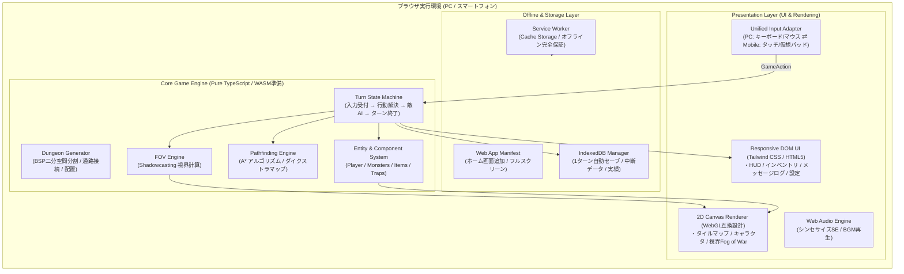

# システムアーキテクチャ設計書（Architecture & Technical Specification）

## 1. 全体アーキテクチャ

本システムは、**完全オフラインで動作するシングルページアプリケーション（SPA）** であり、プログレッシブウェブアプリ（PWA）としてネイティブアプリ同等の体験を提供します。



---

## 2. ディレクトリ構造

拡張性と保守性を重視した、クリーンなレイヤードアーキテクチャを採用します。

```text
WebGame01/
├── docs/                      # 企画書・設計書・ロードマップ
│   ├── 01_game_design.md
│   ├── 02_architecture.md
│   └── 03_roadmap.md
├── public/                    # 静的アセット (PWAアイコン, 音源等)
│   ├── favicon.ico
│   ├── manifest.json          # PWA設定
│   └── icons/                 # 各サイズのアプリアイコン (192x192, 512x512)
├── src/
│   ├── core/                  # ゲームエンジン・ロジック (UI/DOM非依存)
│   │   ├── algorithms/        # アルゴリズム (BSP生成, FOV, A*探索)
│   │   ├── entities/          # エンティティ定義 (Actor, Player, Monster, Item)
│   │   ├── systems/           # 各種システム (TurnSystem, CombatSystem, InventorySystem)
│   │   ├── types/             # 共通型定義 (Point, Direction, GameAction, TileType)
│   │   └── GameEngine.ts      # ゲーム全体の統合ファサード
│   ├── render/                # 描画レイヤー
│   │   ├── CanvasRenderer.ts  # Canvas 2D 描画クラス (タイリング・カメラ・視界暗黒)
│   │   ├── Camera.ts          # プレイヤー追従・ズーム・パン制御
│   │   └── SpriteSheet.ts     # タイル・スプライト管理
│   ├── input/                 # 入力抽象化レイヤー
│   │   ├── InputManager.ts    # 統一入力マネージャー
│   │   ├── KeyboardInput.ts   # PCキーボード対応 (WASD, テンキー, 矢印)
│   │   ├── MouseInput.ts      # PCマウスクリック・ドラッグ
│   │   └── TouchInput.ts      # スマホ仮想パッド・スワイプ・ピンチズーム
│   ├── storage/               # データ永続化 (IndexedDB)
│   │   ├── StorageManager.ts  # IndexedDBラッパー
│   │   └── SaveSerializer.ts  # セーブデータのシリアライズ / 復元
│   ├── ui/                    # レスポンシブDOM UI
│   │   ├── components/        # HUD, VirtualPad, InventoryDialog, LogBox
│   │   └── UIManager.ts       # DOM UIとゲームエンジンのイベント連携
│   ├── audio/                 # サウンド管理 (Web Audio API)
│   │   └── SoundManager.ts
│   ├── sw/                    # サービスワーカー
│   │   └── sw.ts              # オフラインキャッシュスクリプト
│   ├── main.ts                # アプリケーションエントリーポイント
│   └── style.css              # レスポンシブレイアウト・スタイル
├── index.html                 # メインHTML
├── package.json
├── tsconfig.json
└── vite.config.ts             # Vite ビルド設定
```

---

## 3. 完全オフラインSPA & PWA設計

### 3.1. オフライン動作ポリシー
- **外部依存の完全排除**:
  - CDNや外部Webフォント、外部APIへの通信は一切行わない。
  - すべてのCSS、JavaScript、アイコン、フォント、音声アセットはバンドル内に閉じる。
- **Service Worker によるキャッシュ戦略（Cache First）**:
  - 初回アクセス時にすべてのアセット（HTML, JS, CSS, 静的アセット）を `Cache Storage` に一括プリキャッシュ。
  - 2回目以降のアクセスはネットワークの有無にかかわらず即座にキャッシュから起動（起動速度 < 300ms）。
  - アップデート検知時は、バックグラウンドで新しいキャッシュをダウンロードし、ゲーム中断を伴わない「更新通知トースト」を表示。

### 3.2. PWA（Web App Manifest）
- `display: "standalone"` を指定し、スマホの「ホーム画面に追加」時にブラウザのアドレスバーやナビゲーションバーを非表示にし、ネイティブアプリ同様の全画面表示を実現。
- `orientation: "any"`（縦横どちらの向きでも起動可能）。

---

## 4. セーブデータ & 永続化設計（IndexedDB）

### 4.1. データストア構成
IndexedDB を採用（LocalStorageの5MB制限や同期ブロックによる描画カクつきを回避）。

1. **`current_run`（現在進行中のゲームデータ）**:
   - **保存タイミング**: **1ターン終了ごと（Auto-save）**
   - **データ構造**:
     - `turnCount`: 現在ターン数
     - `floor`: 現在階層
     - `seed`: ダンジョン乱数シード
     - `player`: ステータス、現在座標、インベントリ、装備品
     - `dungeon`: マップタイル（探索済みフラグ、視界フラグ含む）
     - `monsters`: 階層内の全生存モンスターの状態・座標
     - `items`: 床に落ちているアイテム一覧
     - `messageLog`: 直近のテキストログ履歴
2. **`persistent_data`（永続データ）**:
   - 実績、最高到達階層、図鑑アンロック、ハイスコア履歴
   - ユーザー設定（BGM音量、SE音量、仮想パッド配置位置、左右利き手設定）

### 4.2. 破損防止 & 復元
- 一時キーへ書き込み後、コミットするアトミック更新を採用。
- プレイヤー死亡時は `current_run` を即座に削除し、パーマデスを厳格に保持。

---

## 5. レスポンシブUI & レンダリング設計

### 5.1. レスポンシブ・ブレークポイントとレイアウト

| 画面モード | 条件 | レイアウト構造 |
|---|---|---|
| **スマホ縦画面 (Portrait)** | 幅 < 768px かつ 縦長 | 上部（約55%）にCanvasゲーム画面。<br>下部（約45%）に大型仮想十字キー＋親指アクションボタン＋クイックスロット。 |
| **スマホ横画面 (Landscape)** | 高さ < 550px かつ 横長 | 中央にCanvasゲーム画面。<br>左下にコンパクト仮想パッド、右下にアクションボタン（透過オーバーレイ）。 |
| **PC / タブレット (Desktop)** | 幅 >= 768px | 左〜中央（約70%）に高解像度Canvas。<br>右側サイドバー（約30%）に詳細ステータス・常時インベントリ・行動ログ。キーボード/マウス操作。 |

### 5.2. CanvasのHiDPI対応とカメラ
- `window.devicePixelRatio` を検知し、Canvasの内部解像度を適切にスケール（Retinaディスプレイでの滲みを防止）。
- `Camera` クラスによる座標変換（ワールド座標 ⇄ スクリーン座標）。
  - プレイヤーを常に中心に捉えつつ、ダンジョン端ではスムーズにスクロールクランプ。
  - タッチピンチ / マウスホイールによる可変ズーム（0.75x 〜 2.0x）。

---

## 6. 入力抽象化レイヤー（Unified Input Adapter）

プラットフォーム（PC / スマホ）ごとに異なる入力を、共通の `GameAction` に集約します。

```typescript
export type GameAction =
  | { type: 'MOVE'; dx: number; dy: number } // 8方向移動
  | { type: 'ATTACK'; dx: number; dy: number } // 指定方向への攻撃
  | { type: 'WAIT' }                          // 足踏み（HP回復）
  | { type: 'PICKUP' }                        // アイテム取得
  | { type: 'DESCEND' }                       // 階段を降りる
  | { type: 'USE_ITEM'; itemId: string }      // アイテム使用
  | { type: 'DROP_ITEM'; itemId: string }     // アイテム捨てる
  | { type: 'CHANGE_FACING'; dx: number; dy: number }; // 向き変更のみ
```

- **PC 入力**:
  - キーボードイベント（`keydown`）を直接 `GameAction` へマッピング。
  - マウスのマップクリック時: 隣接マスなら移動/攻撃、離れたマスなら A* 探索による「自動歩行アクションキュー」を生成。
- **スマホ 入力**:
  - 画面上の仮想パッド（D-pad）タッチイベントから `MOVE` を発行。
  - スワイプジェスチャーによる直感移動もサポート。

---

## 7. コアアルゴリズム設計

### 7.1. ダンジョン生成（BSP: Binary Space Partitioning）
1. ダンジョン全体（例: 60x40セル）を再帰的に縦・横に二分割。
2. 分割された各リーフ領域の内側に、ランダムな大きさの部屋（Room）を生成。
3. 二分木の隣接ノード同士を通路（Corridor: 幅1マス、L字型または直線）で接続。
4. 孤立エリアが存在しないことを保証し、最遠の部屋同士に「スタート地点」と「階段」を配置。

### 7.2. 視界計算（Shadowcasting FOV）
- プレイヤーの周囲半径（例: 8マス）に対して、レイキャスティングよりも高速な **Recursive Shadowcasting（再帰的影落とし）** を採用。
- 壁の角で視線が正しく遮られる、不自然さのない対称的な視界（プレイヤーが見える位置からは敵も見える）を保証。
- 探索済みエリアは「薄暗い状態（壁と床の形のみ表示）」、視界内のみ「敵やアイテムをリアルタイム表示」。

### 7.3. 敵AI（A* Pathfinding）
- モンスターはプレイヤーが視界内に入ると追跡状態（Aggressive）へ遷移。
- 壁や他のモンスターを障害物とした A* アルゴリズムで最短経路を計算して接近。
- 隣接した場合は攻撃アクションを実行。

---

## 8. 将来の拡張性（WASM / WebGL）

本アーキテクチャでは、ゲームロジック（`GameEngine`）と描画（`CanvasRenderer`）が完全にインターフェースで分離されています。
- **WASM適用ポイント**:
  - ダンジョン自動生成や、数千体のユニット・領地計算（モナーク風要素）を追加したくなった場合、`core/algorithms/` 内の計算モジュールを Rust で作成した `.wasm` モジュールに透過的に差し替え可能。
- **WebGL適用ポイント**:
  - 大量のエフェクトやパーティクルを描画したくなった場合、`render/CanvasRenderer.ts` を PixiJS または Three.js などの WebGL レンダラーに容易に置換可能。
