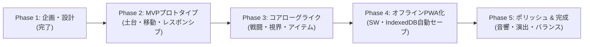

# 開発ロードマップ & マイルストーン（Roadmap & Milestones）

本プロジェクト（完全オフラインSPA・レスポンシブローグライクゲーム）の開発工程とマイルストーンを定義します。

---

## 全体スケジュール概要

---

## 各フェーズの詳細

### Phase 1: 企画・設計策定（完了）
- [x] ゲーム企画書（GDD）の作成 (`docs/01_game_design.md`)
- [x] システムアーキテクチャ設計書の作成 (`docs/02_architecture.md`)
- [x] 開発ロードマップの作成 (`docs/03_roadmap.md`)

---

### Phase 2: MVPプロトタイプ（基盤・ダンジョン生成・レスポンシブ入力）
**【目標】ブラウザを開いた瞬間、PCでもスマホでもランダムなダンジョンを歩き回れる状態を作る。**

1. **プロジェクト基盤構築**:
   - Vite + TypeScript + Tailwind CSS の環境構築
   - ディレクトリ構成の展開
2. **描画基盤**:
   - `CanvasRenderer`: HiDPI対応のグリッド描画、カメラ追従
3. **ダンジョン生成**:
   - `DungeonGenerator`: BSPアルゴリズムによる部屋と通路の自動生成
4. **レスポンシブUI & 入力**:
   - PC: 矢印キー・WASD・テンキーによる移動
   - スマホ: 画面比率に応じたレイアウト切り替え、仮想十字キー（D-pad）によるタッチ移動
   - レスポンシブコンテナによる画面自動リサイズ対応

---

### Phase 3: コアローグライクシステム（ゲームサイクルの成立）
**【目標】敵と戦い、アイテムを拾い、階段を降りて次のフロアへ進める状態を作る。**

1. **視界システム（Fog of War）**:
   - `Shadowcasting FOV`: プレイヤー視界内の照らし出しと未探索エリアの暗黒化
2. **ターン管理 & 敵AI**:
   - `TurnManager`: プレイヤー1歩 → 敵1歩の同時ターン制ステートマシン
   - `A* Pathfinding`: モンスターの追跡・攻撃AI
3. **アイテム & インベントリ**:
   - 床落ちアイテムの取得
   - ポーション、巻物、食料、装備品の使用・装備
   - スマホ縦画面でも使いやすいボトムシート型インベントリUI
4. **階層遷移 & リソース**:
   - 階段による次階層への深化（難易度上昇）
   - HP自然回復と満腹度（空腹システム）の実装

---

### Phase 4: 完全オフラインSPA & PWA化 & 状態永続化
**【目標】電波がなくても起動でき、いつでも中断・再開できる状態を作る。**

1. **Service Worker（完全オフラインキャッシュ）**:
   - 全静的アセットのCache Storage登録
   - ネット未接続時でも瞬時に起動するSPAの実現
2. **PWA（Web App Manifest）**:
   - ホーム画面追加アイコン、スプラッシュスクリーン、全画面（スタンドアロン）起動対応
3. **IndexedDBオートセーブ**:
   - 1ターンごとの自動保存
   - ブラウザリロードやアプリ再起動時の中断データ自動復元
   - 死亡時のセーブデータ消去（パーマデス担保）

---

### Phase 5: ポリッシュ・サウンド・完成
**【目標】気持ちいい手応えと演出を加え、製品クオリティに仕上げる。**

1. **サウンドエンジン（Web Audio API）**:
   - 外部音声ファイルを読み込まずにプログラム合成で鳴らすレトロSE（足音、攻撃、被弾、アイテム使用）
2. **ビジュアル演出**:
   - ダメージ数値のポップアップ、攻撃アニメーション
   - 死亡時のゲームオーバー画面、到達階層リザルト表示
3. **バランス調整 & 実績システム**:
   - モンスターの種類追加、アイテム出現確率の調整
   - 最高到達階層やハイスコアのローカル永続記録
