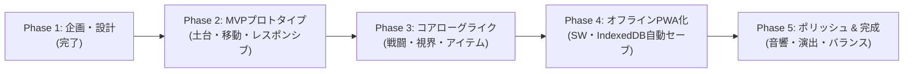

# 開発ロードマップ & マイルストーン（Roadmap & Milestones）

本プロジェクト（完全オフラインSPA・レスポンシブローグライクゲーム）の開発工程とマイルストーンを定義します。

---

## 全体スケジュール概要

---

## 各フェーズの詳細

### Phase 1: 企画・設計策定（完了）
- [x] ゲーム企画書（GDD）の作成 (`docs/01_game_design.md`)
- [x] システムアーキテクチャ設計書の作成 (`docs/02_architecture.md`)
- [x] 開発ロードマップの作成 (`docs/03_roadmap.md`)

---

### Phase 2: MVPプロトタイプ（基盤・ダンジョン生成・レスポンシブ入力）
**【目標】ブラウザを開いた瞬間、PCでもスマホでもランダムなダンジョンを歩き回れる状態を作る。**

1. **プロジェクト基盤構築**:
   - Vite + TypeScript + Tailwind CSS の環境構築
   - ディレクトリ構成の展開
2. **描画基盤**:
   - `CanvasRenderer`: HiDPI対応のグリッド描画、カメラ追従
3. **ダンジョン生成**:
   - `DungeonGenerator`: BSPアルゴリズムによる部屋と通路の自動生成
4. **レスポンシブUI & 入力**:
   - PC: 矢印キー・WASD・テンキーによる移動
   - スマホ: 画面比率に応じたレイアウト切り替え、仮想十字キー（D-pad）によるタッチ移動
   - レスポンシブコンテナによる画面自動リサイズ対応

---

### Phase 3: コアローグライクシステム（ゲームサイクルの成立）
**【目標】敵と戦い、アイテムを拾い、階段を降りて次のフロアへ進める状態を作る。**

1. **視界システム（Fog of War）**:
   - `Shadowcasting FOV`: プレイヤー視界内の照らし出しと未探索エリアの暗黒化
2. **ターン管理 & 敵AI**:
   - `TurnManager`: プレイヤー1歩 → 敵1歩の同時ターン制ステートマシン
   - `A* Pathfinding`: モンスターの追跡・攻撃AI
3. **アイテム & インベントリ**:
   - 床落ちアイテムの取得
   - ポーション、巻物、食料、装備品の使用・装備
   - スマホ縦画面でも使いやすいボトムシート型インベントリUI
4. **階層遷移 & リソース**:
   - 階段による次階層への深化（難易度上昇）
   - HP自然回復と満腹度（空腹システム）の実装

---

### Phase 4: 完全オフラインSPA & PWA化 & 状態永続化
**【目標】電波がなくても起動でき、いつでも中断・再開できる状態を作る。**

1. **Service Worker（完全オフラインキャッシュ）**:
   - 全静的アセットのCache Storage登録
   - ネット未接続時でも瞬時に起動するSPAの実現
2. **PWA（Web App Manifest）**:
   - ホーム画面追加アイコン、スプラッシュスクリーン、全画面（スタンドアロン）起動対応
3. **IndexedDBオートセーブ**:
   - 1ターンごとの自動保存
   - ブラウザリロードやアプリ再起動時の中断データ自動復元
   - 死亡時のセーブデータ消去（パーマデス担保）

---

### Phase 5: ポリッシュ・サウンド・完成（完了）
**【目標】気持ちいい手応えと演出を加え、製品クオリティに仕上げる。**

1. **サウンドエンジン（Web Audio API）**:
   - 外部音声ファイルを読み込まずにプログラム合成で鳴らすレトロSE（足音、攻撃、被弾、アイテム使用）
2. **ビジュアル演出**:
   - ダメージ数値のポップアップ、攻撃アニメーション
   - 死亡時のゲームオーバー画面、到達階層リザルト表示
3. **バランス調整 & 実績システム**:
   - モンスターの種類追加、アイテム出現確率の調整
   - 最高到達階層やハイスコアのローカル永続記録

---

### Phase 6: 戦闘・アイテム大拡張と遠距離戦術（案A - 実装完了）
**【目標】矢・魔法の杖・腕輪・新草・新巻物による遠距離戦術と状態異常インタラクションの確立。**

1. **飛び道具・射撃システム**:
   - [x] 木の矢・鉄の矢・銀の矢（8方向直線レイキャスト射撃、全貫通銀の矢、地面落下回収）
   - [x] 飛翔体アニメーションエンジン（`VisualProjectile`）による弾道描画
2. **魔法の杖・ビームシステム**:
   - [x] 吹き飛ばし（ノックバック＋壁激突10ダメ）、場所替え、かなしばり、睡眠、封印、雷鳴（固定25ダメ）
   - [x] レーザービーム描画と頭上状態異常アイコン（⚡, 💤, 💫, 🔒）のリアルタイム表示
3. **アイテム大拡張（全8カテゴリ・約40種）**:
   - [x] 弟切草（HP100回復/アンデッド特効）、命の草（最大HP+5）、すばやさの草（10ターン倍速）
   - [x] 復活の草（倒れた瞬間の奇跡の即時全快蘇生）
   - [x] 天の恵み（武器+1）・地の恵み（盾+1）・真空斬り（部屋全体20ダメ）の巻物
   - [x] 腕輪装備枠（ちから、遠見、すり抜け）
   - [x] 特効武器（ドラゴンキラー2倍特効、ホーリーランス）
4. **UI操作性・ビジュアル強化**:
   - [x] 所持品カードに `[撃つ]`, `[振る]`, `[投げる]` 専用ボタンを追加
   - [x] 強化値 `+1`、矢残数 `[15]`、杖回数 `[5]` のタイトル表示
   - [x] 全新アイテムのモダンSVGスプライト定義

---

### Phase 7: 50階層深層迷宮・商店・錬成・ボス戦・真のエンディング
**【目標】50階層のロングレンジダンジョン、ゴールド経済、武具錬成、そして物語の完結。**

1. **ダンジョン内商人（フロア商店・売買・泥棒システム）**:
   - [x] ゴールド通貨（Gold）のドロップ・所持金加算・HUD表示
   - [x] 店主ネロ（NPC）と高級ボルドー絨毯ショップ部屋の自動生成
   - [x] 足元買値・売値バッジ表示、店内会話・自動精算・床置き売却査定
   - [x] 未会計持ち逃げによる「泥棒警報！」発令、激怒店主化、番犬（ガードドッグ）召喚追撃、階段脱出による泥棒大成功
2. **合成・鍛冶錬成システム（次期実装）**:
   - 武器・盾同士の合成による強化値合算と印（特効）の引継ぎ
3. **全50階層バイオーム＆深層環境**:
   - 第1〜10層: 石造迷宮
   - 第11〜20層: 地下氷雪（氷上スリップ床、押せる雪塊・氷塊）
   - 第21〜30層: 毒沼・泥濘の湿地（足止め、毒ダメージ）
   - 第31〜40層: 灼熱の溶岩洞窟（マグマ、遠距離強敵）
   - 第41〜49層: 深層神殿・試練の回廊（複合バイオーム）
   - 第50層: 最深部・奈落の祭壇（ボスフロア）
4. **ストーリーイベント・ボス戦・真のエンディング**:
   - フロア突入時のストーリーモノローグ
   - 第50層ボスの多段階攻撃パターン演出
   - ボス撃破後のエンディングデモ、スタッフロール、冒険記最終スコア画面

