# キャラクター＆アイテム仕様設計書（Character & Item Specification）

本ドキュメントでは、ゲーム内に登場するプレイヤー、各モンスター、武器・盾、およびアイテムの**実際のベクターグラフィック画像（SVG）**、**8方向（正面/背面/真横/斜め前/斜め奥）**、**装備ペーパードール外見変化**、**ステータス設定**、**行動AI**、および**アニメーション仕様**を定義します。

風来のシレンやトルネコの大冒険のプレイフィールに準拠し、斜め移動・斜め攻撃を含む8方向への自動追従、手足の歩行ステップ、浮遊アイテム演出、および中世クラシックファンタジー世界観に統一されたアートワークを網羅しています。

---

## 1. 冒険者（プレイヤー / Player）

### 8方向ビジュアルプレビュー（未装備素体 / Base Form）
初期状態の冒険者は剣や盾を持たず、革の手袋と拳で身軽に行動します。

<div style="display: flex; gap: 16px; flex-wrap: wrap; margin-bottom: 20px;">
  <!-- 正面（下向き / 南） -->
  <div style="background-color: #0f172a; border: 1px solid #334155; border-radius: 12px; padding: 16px; text-align: center; width: 140px;">
    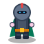
    <div style="color: #34d399; font-weight: bold; font-size: 13px; margin-top: 6px;">正面（Down）</div>
    <div style="color: #94a3b8; font-size: 11px;">南（真下）</div>
  </div>

  <!-- 背面（上向き / 北 / 後ろ姿） -->
  <div style="background-color: #0f172a; border: 1px solid #334155; border-radius: 12px; padding: 16px; text-align: center; width: 140px;">
    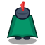
    <div style="color: #6ee7b7; font-weight: bold; font-size: 13px; margin-top: 6px;">背面（Up）</div>
    <div style="color: #94a3b8; font-size: 11px;">北（真上・背中）</div>
  </div>

  <!-- 横向き（Side / 東・西） -->
  <div style="background-color: #0f172a; border: 1px solid #334155; border-radius: 12px; padding: 16px; text-align: center; width: 140px;">
    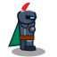
    <div style="color: #60a5fa; font-weight: bold; font-size: 13px; margin-top: 6px;">真横（Side）</div>
    <div style="color: #94a3b8; font-size: 11px;">東/西（左右反転）</div>
  </div>

  <!-- 斜め前（Diag Down / 南東・南西） -->
  <div style="background-color: #0f172a; border: 1px solid #334155; border-radius: 12px; padding: 16px; text-align: center; width: 140px;">
    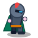
    <div style="color: #38bdf8; font-weight: bold; font-size: 13px; margin-top: 6px;">斜め前（Diag Down）</div>
    <div style="color: #94a3b8; font-size: 11px;">南東/南西</div>
  </div>

  <!-- 斜め奥（Diag Up / 北東・北西） -->
  <div style="background-color: #0f172a; border: 1px solid #334155; border-radius: 12px; padding: 16px; text-align: center; width: 140px;">
    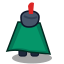
    <div style="color: #a78bfa; font-weight: bold; font-size: 13px; margin-top: 6px;">斜め奥（Diag Up）</div>
    <div style="color: #94a3b8; font-size: 11px;">北東/北西</div>
  </div>

  <!-- 倒れ姿（力尽き / Dead） -->
  <div style="background-color: #0f172a; border: 1px solid #7f1d1d; border-radius: 12px; padding: 16px; text-align: center; width: 140px;">
    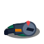
    <div style="color: #f87171; font-weight: bold; font-size: 13px; margin-top: 6px;">倒れ姿（Dead）</div>
    <div style="color: #94a3b8; font-size: 11px;">力尽き・散らばる武具</div>
  </div>
</div>

---

### 装備動的反映（ペーパードールシステム）プレビュー
インベントリで武器や盾を装備すると、装備品固有のグラフィックがリアルタイムにプレイヤーキャラクターへ合成されます。

<div style="display: flex; gap: 16px; flex-wrap: wrap; margin-bottom: 20px;">
  <!-- 鉄の剣 ＋ 鋼の盾 -->
  <div style="background-color: #0f172a; border: 1px solid #334155; border-radius: 12px; padding: 16px; text-align: center; width: 150px;">
    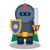
    <div style="color: #38bdf8; font-weight: bold; font-size: 13px; margin-top: 6px;">王道の重装戦士</div>
    <div style="color: #94a3b8; font-size: 11px;">鉄の剣 ＋ 鋼の盾</div>
  </div>

  <!-- 炎の剣 ＋ ドラゴンの盾 -->
  <div style="background-color: #0f172a; border: 1px solid #ef4444; border-radius: 12px; padding: 16px; text-align: center; width: 150px;">
    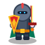
    <div style="color: #ef4444; font-weight: bold; font-size: 13px; margin-top: 6px;">真紅の竜騎士</div>
    <div style="color: #94a3b8; font-size: 11px;">炎の剣 ＋ ドラゴンの盾</div>
  </div>

  <!-- ミスリルの剣 ＋ 魔法の盾 -->
  <div style="background-color: #0f172a; border: 1px solid #818cf8; border-radius: 12px; padding: 16px; text-align: center; width: 150px;">
    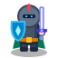
    <div style="color: #818cf8; font-weight: bold; font-size: 13px; margin-top: 6px;">秘術の聖騎士</div>
    <div style="color: #94a3b8; font-size: 11px;">ミスリルの剣 ＋ 魔法の盾</div>
  </div>

  <!-- 青銅の短剣 ＋ 木の盾 -->
  <div style="background-color: #0f172a; border: 1px solid #b45309; border-radius: 12px; padding: 16px; text-align: center; width: 150px;">
    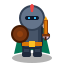
    <div style="color: #f59e0b; font-weight: bold; font-size: 13px; margin-top: 6px;">軽装の探索者</div>
    <div style="color: #94a3b8; font-size: 11px;">青銅の短剣 ＋ 木の盾</div>
  </div>

  <!-- ルーンの剣 ＋ 青銅の盾 -->
  <div style="background-color: #0f172a; border: 1px solid #10b981; border-radius: 12px; padding: 16px; text-align: center; width: 150px;">
    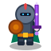
    <div style="color: #34d399; font-weight: bold; font-size: 13px; margin-top: 6px;">古代の魔剣士</div>
    <div style="color: #94a3b8; font-size: 11px;">ルーンの剣 ＋ 青銅の盾</div>
  </div>
</div>

---

### 基本ステータス（初期値＆レベルアップ仕様）
| 項目 | 初期値 | 成長仕様・ゲーム難易度調整 |
|---|---|---|
| **HP / 最大HP** | 20 / 20 | レベルアップ時に最大HP +5。<br/>**HP回復量は最大HP上昇分（+5）のみ**（完全復活ではなく上昇分回復とすることで、回復薬や足踏みの戦略性を維持）。 |
| **基礎攻撃力 (Base ATK)** | 5 | レベルアップ時に +2、装備品（武器）で加算 |
| **基礎防御力 (Base DEF)** | 1 | レベルアップ時に +1、装備品（盾）で加算 |
| **満腹度 (Hunger)** | 100% | 10ターンごとに 1% 消費。0%で1ターンにつき1ダメージの餓死危険 |
| **初期所持品** | 薬草 × 1 | HP 15 回復 |

---

## 2. 敵モンスター＆第50層ボス一覧（Monster & Boss Specification）

ダンジョンのバイオームおよびフロア深度（1〜50階）に応じて、個性豊かで凶悪なモンスターが生息しています。
スライムと同等以上の圧倒的なクオリティを目指し、全モンスターが武器（棍棒、錆びた剣、三叉銛、魔導杖、ピッチフォークなど）・防具（円盾、バックラー、革鎧、ブレストプレートなど）・立体陰影・骨格/筋肉テクスチャ・発光エフェクト（ソウルアイ、赤熱ブレス、魔導オーブ、古代呪眼）を備えた、超美麗な純粋ベクターSVGで描画されます。また、全種が8方向追従に対応しています。

<div style="display: flex; gap: 16px; flex-wrap: wrap; margin-bottom: 20px;">
  <!-- スライム -->
  <div style="background-color: #0f172a; border: 1px solid #334155; border-radius: 12px; padding: 16px; text-align: center; width: 140px;">
    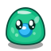
    <div style="color: #34d399; font-weight: bold; font-size: 13px; margin-top: 6px;">スライム</div>
    <div style="color: #94a3b8; font-size: 11px;">HP: 8 / ATK: 3</div>
    <div style="color: #64748b; font-size: 10px; margin-top: 2px;">全域浅層に出現</div>
  </div>

  <!-- ゴブリン -->
  <div style="background-color: #0f172a; border: 1px solid #334155; border-radius: 12px; padding: 16px; text-align: center; width: 140px;">
    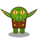
    <div style="color: #f59e0b; font-weight: bold; font-size: 13px; margin-top: 6px;">ゴブリン</div>
    <div style="color: #94a3b8; font-size: 11px;">HP: 16 / ATK: 6</div>
    <div style="color: #64748b; font-size: 10px; margin-top: 2px;">棍棒を振り回す小鬼</div>
  </div>

  <!-- スケルトン -->
  <div style="background-color: #0f172a; border: 1px solid #334155; border-radius: 12px; padding: 16px; text-align: center; width: 140px;">
    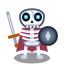
    <div style="color: #e2e8f0; font-weight: bold; font-size: 13px; margin-top: 6px;">スケルトン</div>
    <div style="color: #94a3b8; font-size: 11px;">HP: 24 / ATK: 9</div>
    <div style="color: #64748b; font-size: 10px; margin-top: 2px;">錆びた剣を持つ骸骨兵</div>
  </div>

  <!-- 岩石ゴーレム -->
  <div style="background-color: #0f172a; border: 1px solid #334155; border-radius: 12px; padding: 16px; text-align: center; width: 140px;">
    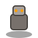
    <div style="color: #f59e0b; font-weight: bold; font-size: 13px; margin-top: 6px;">岩石ゴーレム</div>
    <div style="color: #94a3b8; font-size: 11px;">HP: 35 / ATK: 12</div>
    <div style="color: #64748b; font-size: 10px; margin-top: 2px;">高い防御と剛腕</div>
  </div>

  <!-- マンドラゴラ -->
  <div style="background-color: #0f172a; border: 1px solid #334155; border-radius: 12px; padding: 16px; text-align: center; width: 140px;">
    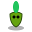
    <div style="color: #4ade80; font-weight: bold; font-size: 13px; margin-top: 6px;">マンドラゴラ</div>
    <div style="color: #94a3b8; font-size: 11px;">HP: 18 / ATK: 7</div>
    <div style="color: #64748b; font-size: 10px; margin-top: 2px;">森林遺跡に潜む怪奇植物</div>
  </div>

  <!-- サハギン戦士 -->
  <div style="background-color: #0f172a; border: 1px solid #334155; border-radius: 12px; padding: 16px; text-align: center; width: 140px;">
    
    <div style="color: #38bdf8; font-weight: bold; font-size: 13px; margin-top: 6px;">サハギン戦士</div>
    <div style="color: #94a3b8; font-size: 11px;">HP: 28 / ATK: 10</div>
    <div style="color: #64748b; font-size: 10px; margin-top: 2px;">三叉槍を構える半魚人</div>
  </div>

  <!-- 吸血コウモリ -->
  <div style="background-color: #0f172a; border: 1px solid #334155; border-radius: 12px; padding: 16px; text-align: center; width: 140px;">
    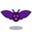
    <div style="color: #f43f5e; font-weight: bold; font-size: 13px; margin-top: 6px;">吸血コウモリ</div>
    <div style="color: #94a3b8; font-size: 11px;">HP: 12 / ATK: 5</div>
    <div style="color: #64748b; font-size: 10px; margin-top: 2px;">暗闇を素早く舞う翼獣</div>
  </div>

  <!-- 彷徨う亡霊 -->
  <div style="background-color: #0f172a; border: 1px solid #334155; border-radius: 12px; padding: 16px; text-align: center; width: 140px;">
    
    <div style="color: #a78bfa; font-weight: bold; font-size: 13px; margin-top: 6px;">彷徨う亡霊</div>
    <div style="color: #94a3b8; font-size: 11px;">HP: 20 / ATK: 8</div>
    <div style="color: #64748b; font-size: 10px; margin-top: 2px;">青白く浮遊する怨霊</div>
  </div>

  <!-- ダークメイジ -->
  <div style="background-color: #0f172a; border: 1px solid #334155; border-radius: 12px; padding: 16px; text-align: center; width: 140px;">
    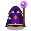
    <div style="color: #c084fc; font-weight: bold; font-size: 13px; margin-top: 6px;">ダークメイジ</div>
    <div style="color: #94a3b8; font-size: 11px;">HP: 26 / ATK: 13</div>
    <div style="color: #64748b; font-size: 10px; margin-top: 2px;">邪術を操る黒魔道士</div>
  </div>

  <!-- レッドドラゴン -->
  <div style="background-color: #0f172a; border: 1px solid #b91c1c; border-radius: 12px; padding: 16px; text-align: center; width: 140px;">
    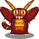
    <div style="color: #ef4444; font-weight: bold; font-size: 13px; margin-top: 6px;">レッドドラゴン</div>
    <div style="color: #94a3b8; font-size: 11px;">HP: 55 / ATK: 18</div>
    <div style="color: #64748b; font-size: 10px; margin-top: 2px;">深層の最凶巨竜</div>
  </div>

  <!-- ミミック -->
  <div style="background-color: #0f172a; border: 1px solid #d97706; border-radius: 12px; padding: 16px; text-align: center; width: 140px;">
    
    <div style="color: #fbbf24; font-weight: bold; font-size: 13px; margin-top: 6px;">人食い箱(ミミック)</div>
    <div style="color: #94a3b8; font-size: 11px;">HP: 30 / ATK: 14</div>
    <div style="color: #64748b; font-size: 10px; margin-top: 2px;">宝箱に擬態・高火力奇襲</div>
  </div>

  <!-- ゾンビ -->
  <div style="background-color: #0f172a; border: 1px solid #15803d; border-radius: 12px; padding: 16px; text-align: center; width: 140px;">
    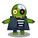
    <div style="color: #4ade80; font-weight: bold; font-size: 13px; margin-top: 6px;">腐乱ゾンビ</div>
    <div style="color: #94a3b8; font-size: 11px;">HP: 38 / ATK: 8</div>
    <div style="color: #64748b; font-size: 10px; margin-top: 2px;">湿地や毒沼の高HP不死者</div>
  </div>

  <!-- インプ -->
  <div style="background-color: #0f172a; border: 1px solid #be185d; border-radius: 12px; padding: 16px; text-align: center; width: 140px;">
    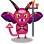
    <div style="color: #f472b6; font-weight: bold; font-size: 13px; margin-top: 6px;">小悪魔インプ</div>
    <div style="color: #94a3b8; font-size: 11px;">HP: 15 / ATK: 11</div>
    <div style="color: #64748b; font-size: 10px; margin-top: 2px;">狡猾・素早い奇襲小悪魔</div>
  </div>

  <!-- 古代ミイラ -->
  <div style="background-color: #0f172a; border: 1px solid #a1a1aa; border-radius: 12px; padding: 16px; text-align: center; width: 140px;">
    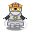
    <div style="color: #e4e4e7; font-weight: bold; font-size: 13px; margin-top: 6px;">古代のミイラ</div>
    <div style="color: #94a3b8; font-size: 11px;">HP: 32 / ATK: 10</div>
    <div style="color: #64748b; font-size: 10px; margin-top: 2px;">呪術の包帯を纏う高防御怪人</div>
  </div>

  <!-- 番犬・警備犬 -->
  <div style="background-color: #0f172a; border: 1px solid #b45309; border-radius: 12px; padding: 16px; text-align: center; width: 140px;">
    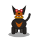
    <div style="color: #f59e0b; font-weight: bold; font-size: 13px; margin-top: 6px;">警備番犬</div>
    <div style="color: #94a3b8; font-size: 11px;">HP: 75 / ATK: 24</div>
    <div style="color: #64748b; font-size: 10px; margin-top: 2px;">泥棒時に群れで追跡・2回行動</div>
  </div>

  <!-- 奈落の魔王アビス・ロード -->
  <div style="background-color: #1e112a; border: 2px solid #a855f7; border-radius: 12px; padding: 16px; text-align: center; width: 140px; box-shadow: 0 0 16px rgba(168,85,247,0.3);">
    
    <div style="color: #c084fc; font-weight: bold; font-size: 13px; margin-top: 6px;">奈落の魔王アビス</div>
    <div style="color: #e879f9; font-size: 11px; font-weight: bold;">HP: 1200 / ATK: 48</div>
    <div style="color: #a855f7; font-size: 10px; margin-top: 2px;">第50層君臨・火炎ブレス</div>
  </div>
</div>

### 2.2. モンスター完全ステータス・マスタ仕様表

各モンスターの生成時基礎値一覧です。
通常モンスターのステータスは出現階層（Floor）に応じて以下の式でスケーリングされます：
$$\text{Stat} = \text{round}(\text{BaseStat} \times (1 + (\text{Floor} - 1) \times 0.15))$$

| 種族名 | 分類Type | 基礎HP | 基礎ATK | 基礎DEF | 基礎EXP | 行動速度 | 特殊行動・AI特性 |
| :--- | :--- | :---: | :---: | :---: | :---: | :---: | :--- |
| **スライム** | `SLIME` | 6 | 2 | 1 | 3 | 通常 | 最弱級モンスター。プレイヤーを発見すると接近。 |
| **ゴブリン** | `GOBLIN` | 12 | 4 | 1 | 7 | 通常 | 浅層の標準的近接戦士。 |
| **スケルトン** | `SKELETON` | 16 | 6 | 2 | 10 | 通常 | やや攻撃力の高い骸骨剣士。 |
| **吸血コウモリ** | `BAT` | 10 | 4 | 1 | 6 | 通常 | 暗闇の洞窟・水流を飛翔する素早い翼獣。 |
| **マンドラゴラ** | `MANDRAGORA` | 22 | 5 | 2 | 12 | 通常 | 樹木・植物系。タフなHPを持つ。 |
| **サハギン戦士** | `SAHAGIN` | 20 | 7 | 2 | 15 | 通常 | 水路・地底湖に生息する半魚人戦士。 |
| **彷徨う亡霊** | `GHOST` | 14 | 6 | 4 | 14 | 通常 | 高い防御力を誇るアンデッド霊体。 |
| **岩石ゴーレム** | `GOLEM` | 35 | 10 | 4 | 30 | **鈍重(1/2)** | 2ターンに1回しか行動できないが、圧倒的高HP・高火力。 |
| **ダークメイジ** | `MAGE` | 18 | 8 | 2 | 25 | 通常 | **射程2〜3マスの中距離遠隔魔法弾**（壁抜け不可）。 |
| **人食い箱** | `MIMIC` | 24 | 8 | 3 | 20 | **休眠擬態** | 宝箱に擬態し刺激（接近/攻撃）を受けるまで完全停止。 |
| **腐乱ゾンビ** | `ZOMBIE` | 20 | 5 | 2 | 11 | **鈍重(1/2)** | 2ターンに1回行動。高HPのアンデッド。 |
| **小悪魔インプ** | `IMP` | 15 | 7 | 2 | 14 | 通常 | **射程2〜3マスの火炎弾**。背後不意打ち死角あり。 |
| **古代のミイラ** | `MUMMY` | 30 | 9 | 4 | 25 | **鈍重(1/2)** | 2ターンに1回行動。呪術の包帯を纏う重装アンデッド。 |
| **レッドドラゴン** | `DRAGON` | 42 | 13 | 5 | 45 | 通常 | **射程2〜3マスの灼熱火炎ブレス**。深層の覇者。 |
| **店主(通常)** | `MERCHANT` | 300 | 50 | 20 | 300 | 通常 | 平時は完全中立NPC。商品陳列・売買精算を行う。 |
| **店主(激怒)** | `MERCHANT` | 350 | 65 | 25 | 500 | **倍速(2回)** | 泥棒時に変貌。毎ターン50%で**固有遠隔追撃**を放つ。 |
| **警備番犬** | `GUARD_DOG` | 28 | 12 | 4 | 30 | **倍速(2回)** | 泥棒発覚時に3頭召喚される俊足追跡犬。 |
| **アビス・ロード** | `ABYSS_LORD` | 300 | 18 | 7 | 1000 | 通常 | 第50層大ボス。火炎ブレス＋全体激震撃破でクリア。 |
| **慈愛の妖精ピクシー** | `HEALING_FAIRY` | 20 | 0 | 1 | 1 | 通常 | レアNPC。周囲のプレイヤー・モンスター双方を癒やす。 |
| **さすらいのレオン** | `WANDERING_ADVENTURER` | 50 | 15 | 8 | 0 | 通常 | レアNPC。プレイヤーの不要アイテムと良質アイテムを物々交換。 |
| **賭博仙人ガンジ** | `GAMBLER_SAGE` | 40 | 10 | 6 | 0 | 通常 | レアNPC。じゃんけん勝負でインベントリ枠増減（12〜20）。 |
| **鍛冶職人バルカン** | `TRAVELING_BLACKSMITH` | 60 | 18 | 10 | 0 | 通常 | レアNPC。装備中の武器または盾を無料+1〜+2鍛錬。 |
| **スクーターおじさん** | `SCOOTER_GUY` | 999 | 0 | 99 | 0 | 通常 | ダンジョンを横断疾走する謎のオジサン。会話のみ。 |

---

## 3. 武具・装備品仕様（Weapons & Shields）

### 武器一覧（Weapons - 全8種）
<div style="display: flex; gap: 16px; flex-wrap: wrap; margin-bottom: 20px;">
  <!-- 青銅の短剣 -->
  <div style="background-color: #0f172a; border: 1px solid #334155; border-radius: 12px; padding: 16px; text-align: center; width: 140px;">
    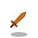
    <div style="color: #f59e0b; font-weight: bold; font-size: 13px; margin-top: 6px;">青銅の短剣</div>
    <div style="color: #94a3b8; font-size: 11px;">ATK +2</div>
  </div>

  <!-- 鉄の剣 -->
  <div style="background-color: #0f172a; border: 1px solid #334155; border-radius: 12px; padding: 16px; text-align: center; width: 140px;">
    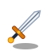
    <div style="color: #38bdf8; font-weight: bold; font-size: 13px; margin-top: 6px;">鉄の剣</div>
    <div style="color: #94a3b8; font-size: 11px;">ATK +4</div>
  </div>

  <!-- ミスリルの剣 -->
  <div style="background-color: #0f172a; border: 1px solid #334155; border-radius: 12px; padding: 16px; text-align: center; width: 140px;">
    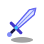
    <div style="color: #818cf8; font-weight: bold; font-size: 13px; margin-top: 6px;">ミスリルの剣</div>
    <div style="color: #94a3b8; font-size: 11px;">ATK +6</div>
  </div>

  <!-- 炎の剣 -->
  <div style="background-color: #0f172a; border: 1px solid #334155; border-radius: 12px; padding: 16px; text-align: center; width: 140px;">
    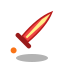
    <div style="color: #ef4444; font-weight: bold; font-size: 13px; margin-top: 6px;">炎の剣</div>
    <div style="color: #94a3b8; font-size: 11px;">ATK +8</div>
  </div>

  <!-- ルーンの剣 -->
  <div style="background-color: #0f172a; border: 1px solid #334155; border-radius: 12px; padding: 16px; text-align: center; width: 140px;">
    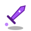
    <div style="color: #34d399; font-weight: bold; font-size: 13px; margin-top: 6px;">ルーンの剣</div>
    <div style="color: #94a3b8; font-size: 11px;">ATK +10</div>
  </div>

  <!-- 妖刀ムラマサ -->
  <div style="background-color: #0f172a; border: 1px solid #991b1b; border-radius: 12px; padding: 16px; text-align: center; width: 140px;">
    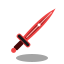
    <div style="color: #f87171; font-weight: bold; font-size: 13px; margin-top: 6px;">妖刀ムラマサ</div>
    <div style="color: #94a3b8; font-size: 11px;">ATK +14</div>
  </div>

  <!-- ウォーハンマー -->
  <div style="background-color: #0f172a; border: 1px solid #eab308; border-radius: 12px; padding: 16px; text-align: center; width: 140px;">
    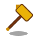
    <div style="color: #fde047; font-weight: bold; font-size: 13px; margin-top: 6px;">ウォーハンマー</div>
    <div style="color: #94a3b8; font-size: 11px;">ATK +9</div>
  </div>

  <!-- ホーリーランス -->
  <div style="background-color: #0f172a; border: 1px solid #38bdf8; border-radius: 12px; padding: 16px; text-align: center; width: 140px;">
    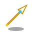
    <div style="color: #bae6fd; font-weight: bold; font-size: 13px; margin-top: 6px;">ホーリーランス</div>
    <div style="color: #94a3b8; font-size: 11px;">ATK +12</div>
  </div>
</div>

### 盾一覧（Shields - 全8種）
<div style="display: flex; gap: 16px; flex-wrap: wrap; margin-bottom: 20px;">
  <!-- 木の盾 -->
  <div style="background-color: #0f172a; border: 1px solid #334155; border-radius: 12px; padding: 16px; text-align: center; width: 140px;">
    
    <div style="color: #d97706; font-weight: bold; font-size: 13px; margin-top: 6px;">木の盾</div>
    <div style="color: #94a3b8; font-size: 11px;">DEF +1</div>
  </div>

  <!-- 青銅の盾 -->
  <div style="background-color: #0f172a; border: 1px solid #334155; border-radius: 12px; padding: 16px; text-align: center; width: 140px;">
    
    <div style="color: #f59e0b; font-weight: bold; font-size: 13px; margin-top: 6px;">青銅の盾</div>
    <div style="color: #94a3b8; font-size: 11px;">DEF +2</div>
  </div>

  <!-- 鋼の盾 -->
  <div style="background-color: #0f172a; border: 1px solid #334155; border-radius: 12px; padding: 16px; text-align: center; width: 140px;">
    
    <div style="color: #38bdf8; font-weight: bold; font-size: 13px; margin-top: 6px;">鋼の盾</div>
    <div style="color: #94a3b8; font-size: 11px;">DEF +4</div>
  </div>

  <!-- 魔法の盾 -->
  <div style="background-color: #0f172a; border: 1px solid #334155; border-radius: 12px; padding: 16px; text-align: center; width: 140px;">
    
    <div style="color: #a78bfa; font-weight: bold; font-size: 13px; margin-top: 6px;">魔法の盾</div>
    <div style="color: #94a3b8; font-size: 11px;">DEF +6</div>
  </div>

  <!-- ドラゴンの盾 -->
  <div style="background-color: #0f172a; border: 1px solid #334155; border-radius: 12px; padding: 16px; text-align: center; width: 140px;">
    
    <div style="color: #ef4444; font-weight: bold; font-size: 13px; margin-top: 6px;">ドラゴンの盾</div>
    <div style="color: #94a3b8; font-size: 11px;">DEF +8</div>
  </div>

  <!-- 風の盾 -->
  <div style="background-color: #0f172a; border: 1px solid #10b981; border-radius: 12px; padding: 16px; text-align: center; width: 140px;">
    
    <div style="color: #34d399; font-weight: bold; font-size: 13px; margin-top: 6px;">風の盾</div>
    <div style="color: #94a3b8; font-size: 11px;">DEF +3</div>
  </div>

  <!-- タワーシールド -->
  <div style="background-color: #0f172a; border: 1px solid #64748b; border-radius: 12px; padding: 16px; text-align: center; width: 140px;">
    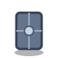
    <div style="color: #94a3b8; font-weight: bold; font-size: 13px; margin-top: 6px;">タワーシールド</div>
    <div style="color: #94a3b8; font-size: 11px;">DEF +7</div>
  </div>

  <!-- イージスの盾 -->
  <div style="background-color: #0f172a; border: 1px solid #f59e0b; border-radius: 12px; padding: 16px; text-align: center; width: 140px;">
    
    <div style="color: #fbbf24; font-weight: bold; font-size: 13px; margin-top: 6px;">イージスの盾</div>
    <div style="color: #94a3b8; font-size: 11px;">DEF +11</div>
  </div>
</div>

---

## 4. アイテム一覧（Items Specification）

<div style="display: flex; gap: 16px; flex-wrap: wrap; margin-bottom: 20px;">
  <!-- 薬草 -->
  <div style="background-color: #0f172a; border: 1px solid #334155; border-radius: 12px; padding: 16px; text-align: center; width: 140px;">
    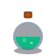
    <div style="color: #34d399; font-weight: bold; font-size: 13px; margin-top: 6px;">薬草</div>
    <div style="color: #94a3b8; font-size: 11px;">HP 15 回復</div>
  </div>

  <!-- 特薬草 -->
  <div style="background-color: #0f172a; border: 1px solid #334155; border-radius: 12px; padding: 16px; text-align: center; width: 140px;">
    
    <div style="color: #10b981; font-weight: bold; font-size: 13px; margin-top: 6px;">特薬草</div>
    <div style="color: #94a3b8; font-size: 11px;">HP 35 回復</div>
  </div>

  <!-- どくけし草 -->
  <div style="background-color: #0f172a; border: 1px solid #16a34a; border-radius: 12px; padding: 16px; text-align: center; width: 140px;">
    
    <div style="color: #4ade80; font-weight: bold; font-size: 13px; margin-top: 6px;">どくけし草</div>
    <div style="color: #94a3b8; font-size: 11px;">HP 10 回復＆解毒</div>
  </div>

  <!-- ちからの種 -->
  <div style="background-color: #0f172a; border: 1px solid #334155; border-radius: 12px; padding: 16px; text-align: center; width: 140px;">
    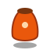
    <div style="color: #fb923c; font-weight: bold; font-size: 13px; margin-top: 6px;">ちからの種</div>
    <div style="color: #94a3b8; font-size: 11px;">ATK +1 永続</div>
  </div>

  <!-- すばやさの種 -->
  <div style="background-color: #0f172a; border: 1px solid #0891b2; border-radius: 12px; padding: 16px; text-align: center; width: 140px;">
    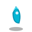
    <div style="color: #38bdf8; font-weight: bold; font-size: 13px; margin-top: 6px;">すばやさの種</div>
    <div style="color: #94a3b8; font-size: 11px;">DEF +1 永続</div>
  </div>

  <!-- 剛力の秘薬 -->
  <div style="background-color: #0f172a; border: 1px solid #334155; border-radius: 12px; padding: 16px; text-align: center; width: 140px;">
    
    <div style="color: #f43f5e; font-weight: bold; font-size: 13px; margin-top: 6px;">剛力の秘薬</div>
    <div style="color: #94a3b8; font-size: 11px;">ATK +2 永続</div>
  </div>

  <!-- 大きなパン -->
  <div style="background-color: #0f172a; border: 1px solid #334155; border-radius: 12px; padding: 16px; text-align: center; width: 140px;">
    
    <div style="color: #fbbf24; font-weight: bold; font-size: 13px; margin-top: 6px;">大きなパン</div>
    <div style="color: #94a3b8; font-size: 11px;">満腹度 50% 回復</div>
  </div>

  <!-- 特製おにぎり -->
  <div style="background-color: #0f172a; border: 1px solid #334155; border-radius: 12px; padding: 16px; text-align: center; width: 140px;">
    
    <div style="color: #fef08a; font-weight: bold; font-size: 13px; margin-top: 6px;">特製おにぎり</div>
    <div style="color: #94a3b8; font-size: 11px;">全快 ＆ 上限+10</div>
  </div>

  <!-- 巨大なおにぎり -->
  <div style="background-color: #0f172a; border: 1px solid #facc15; border-radius: 12px; padding: 16px; text-align: center; width: 140px;">
    
    <div style="color: #fef08a; font-weight: bold; font-size: 13px; margin-top: 6px;">巨大なおにぎり</div>
    <div style="color: #94a3b8; font-size: 11px;">全快 ＆ 上限+20</div>
  </div>

  <!-- ワープの巻物 -->
  <div style="background-color: #0f172a; border: 1px solid #334155; border-radius: 12px; padding: 16px; text-align: center; width: 140px;">
    
    <div style="color: #818cf8; font-weight: bold; font-size: 13px; margin-top: 6px;">ワープの巻物</div>
    <div style="color: #94a3b8; font-size: 11px;">ランダム瞬間移動</div>
  </div>

  <!-- 雷の巻物 -->
  <div style="background-color: #0f172a; border: 1px solid #334155; border-radius: 12px; padding: 16px; text-align: center; width: 140px;">
    
    <div style="color: #facc15; font-weight: bold; font-size: 13px; margin-top: 6px;">雷の巻物</div>
    <div style="color: #94a3b8; font-size: 11px;">部屋全体15ダメージ</div>
  </div>

  <!-- あかりの巻物 -->
  <div style="background-color: #0f172a; border: 1px solid #334155; border-radius: 12px; padding: 16px; text-align: center; width: 140px;">
    
    <div style="color: #38bdf8; font-weight: bold; font-size: 13px; margin-top: 6px;">あかりの巻物</div>
    <div style="color: #94a3b8; font-size: 11px;">フロア全域マップ開示</div>
  </div>

  <!-- 睡眠の巻物 -->
  <div style="background-color: #0f172a; border: 1px solid #6366f1; border-radius: 12px; padding: 16px; text-align: center; width: 140px;">
    
    <div style="color: #a5b4fc; font-weight: bold; font-size: 13px; margin-top: 6px;">睡眠の巻物</div>
    <div style="color: #94a3b8; font-size: 11px;">部屋全体の敵を行動不能</div>
  </div>

  <!-- 混乱の巻物 -->
  <div style="background-color: #0f172a; border: 1px solid #ec4899; border-radius: 12px; padding: 16px; text-align: center; width: 140px;">
    
    <div style="color: #f472b6; font-weight: bold; font-size: 13px; margin-top: 6px;">混乱の巻物</div>
    <div style="color: #94a3b8; font-size: 11px;">部屋全体の敵を同士討ち</div>
  </div>

  <!-- 合成の壺 -->
  <div style="background-color: #082f49; border: 2px solid #06b6d4; border-radius: 12px; padding: 16px; text-align: center; width: 140px; box-shadow: 0 0 12px rgba(6,182,212,0.3);">
    
    <div style="color: #22d3ee; font-weight: bold; font-size: 13px; margin-top: 6px;">合成の壺</div>
    <div style="color: #67e8f9; font-size: 11px;">武具強化値合算＆印継承</div>
  </div>

  <!-- 復活の草 -->
  <div style="background-color: #0f172a; border: 1px solid #eab308; border-radius: 12px; padding: 16px; text-align: center; width: 140px;">
    
    <div style="color: #facc15; font-weight: bold; font-size: 13px; margin-top: 6px;">復活の草</div>
    <div style="color: #94a3b8; font-size: 11px;">力尽きた時にHP全快蘇生</div>
  </div>

  <!-- 弟切草 -->
  <div style="background-color: #0f172a; border: 1px solid #10b981; border-radius: 12px; padding: 16px; text-align: center; width: 140px;">
    
    <div style="color: #34d399; font-weight: bold; font-size: 13px; margin-top: 6px;">弟切草</div>
    <div style="color: #94a3b8; font-size: 11px;">HP 100 回復</div>
  </div>

  <!-- 命の草 -->
  <div style="background-color: #0f172a; border: 1px solid #ec4899; border-radius: 12px; padding: 16px; text-align: center; width: 140px;">
    
    <div style="color: #f472b6; font-weight: bold; font-size: 13px; margin-top: 6px;">命の草</div>
    <div style="color: #94a3b8; font-size: 11px;">最大HP +5 永続上昇</div>
  </div>

  <!-- ゴールドの山 -->
  <div style="background-color: #0f172a; border: 1px solid #ca8a04; border-radius: 12px; padding: 16px; text-align: center; width: 140px;">
    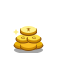
    <div style="color: #fbbf24; font-weight: bold; font-size: 13px; margin-top: 6px;">ゴールド通貨</div>
    <div style="color: #94a3b8; font-size: 11px;">ショップ売買用の資金</div>
  </div>

  <!-- 木の矢 -->
  <div style="background-color: #0f172a; border: 1px solid #78350f; border-radius: 12px; padding: 16px; text-align: center; width: 140px;">
    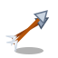
    <div style="color: #d97706; font-weight: bold; font-size: 13px; margin-top: 6px;">木の矢</div>
    <div style="color: #94a3b8; font-size: 11px;">直線の敵へ遠隔射撃</div>
  </div>

  <!-- 魔法の杖 -->
  <div style="background-color: #0f172a; border: 1px solid #7e22ce; border-radius: 12px; padding: 16px; text-align: center; width: 140px;">
    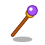
    <div style="color: #c084fc; font-weight: bold; font-size: 13px; margin-top: 6px;">魔法の杖</div>
    <div style="color: #94a3b8; font-size: 11px;">直線魔法光線を放つ</div>
  </div>

  <!-- まもりの指輪 -->
  <div style="background-color: #0f172a; border: 1px solid #38bdf8; border-radius: 12px; padding: 16px; text-align: center; width: 140px;">
    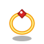
    <div style="color: #38bdf8; font-weight: bold; font-size: 13px; margin-top: 6px;">まもりの指輪</div>
    <div style="color: #94a3b8; font-size: 11px;">装備中 DEF +3</div>
  </div>

  <!-- 天の恵みの巻物 -->
  <div style="background-color: #0f172a; border: 1px solid #eab308; border-radius: 12px; padding: 16px; text-align: center; width: 140px;">
    
    <div style="color: #facc15; font-weight: bold; font-size: 13px; margin-top: 6px;">天の恵みの巻物</div>
    <div style="color: #94a3b8; font-size: 11px;">装備中の武器を+1強化</div>
  </div>

  <!-- 地の恵みの巻物 -->
  <div style="background-color: #0f172a; border: 1px solid #3b82f6; border-radius: 12px; padding: 16px; text-align: center; width: 140px;">
    
    <div style="color: #60a5fa; font-weight: bold; font-size: 13px; margin-top: 6px;">地の恵みの巻物</div>
    <div style="color: #94a3b8; font-size: 11px;">装備中の盾を+1強化</div>
  </div>

  <!-- 真空斬りの巻物 -->
  <div style="background-color: #0f172a; border: 1px solid #06b6d4; border-radius: 12px; padding: 16px; text-align: center; width: 140px;">
    
    <div style="color: #22d3ee; font-weight: bold; font-size: 13px; margin-top: 6px;">真空斬りの巻物</div>
    <div style="color: #94a3b8; font-size: 11px;">部屋全体の敵へ鋭い真空波</div>
  </div>
</div>

### 持ち物整理機能（インベントリソート）
- **操作方法**:
  - デスクトップ版: インベントリパネルの「整 整理」ボタンをクリック、またはキーボード「O」キー。
  - スマホ/タブレット版: 持ち物ダイアログヘッダー内の「整 整理」ボタンをタップ。
- **並び順ルール**:
  1. 装備中のアイテム（武器・盾）を最優先で先頭に配置
  2. アイテム種別順（武器 → 盾 → 薬草・種 → 食料 → 巻物）
  3. 同種別内では効果値・レアリティ順

---

## 5. インタラクティブ障害物・ギミックオブジェクト（Obstacles）

ダンジョン内には単なる壁や川だけでなく、プレイヤーの攻撃や体当たりによってインタラクトできるオブジェクトが配置されます。

<div style="display: flex; gap: 16px; flex-wrap: wrap; margin-bottom: 20px;">
  <!-- 土の塊 -->
  <div style="background-color: #0f172a; border: 1px solid #78350f; border-radius: 12px; padding: 16px; text-align: center; width: 140px;">
    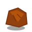
    <div style="color: #d97706; font-weight: bold; font-size: 13px; margin-top: 6px;">土の塊</div>
    <div style="color: #94a3b8; font-size: 11px;">耐久: 2 / 破壊可能</div>
    <div style="color: #64748b; font-size: 10px; margin-top: 2px;">粉砕時にアイテム出現</div>
  </div>

  <!-- 倒木 -->
  <div style="background-color: #0f172a; border: 1px solid #451a03; border-radius: 12px; padding: 16px; text-align: center; width: 140px;">
    
    <div style="color: #b45309; font-weight: bold; font-size: 13px; margin-top: 6px;">倒木・木塊</div>
    <div style="color: #94a3b8; font-size: 11px;">耐久: 3 / 破壊可能</div>
    <div style="color: #64748b; font-size: 10px; margin-top: 2px;">攻撃3回で粉砕</div>
  </div>

  <!-- 雪の塊 -->
  <div style="background-color: #0f172a; border: 1px solid #bae6fd; border-radius: 12px; padding: 16px; text-align: center; width: 140px;">
    
    <div style="color: #e0f2fe; font-weight: bold; font-size: 13px; margin-top: 6px;">雪の塊</div>
    <div style="color: #94a3b8; font-size: 11px;">耐久: 1 / 破壊可能</div>
    <div style="color: #64748b; font-size: 10px; margin-top: 2px;">一撃で砕け散る</div>
  </div>

  <!-- 押せる石 -->
  <div style="background-color: #0f172a; border: 1px solid #64748b; border-radius: 12px; padding: 16px; text-align: center; width: 140px;">
    
    <div style="color: #cbd5e1; font-weight: bold; font-size: 13px; margin-top: 6px;">押せる大石</div>
    <div style="color: #94a3b8; font-size: 11px;">破壊不能 / 押し移動</div>
    <div style="color: #64748b; font-size: 10px; margin-top: 2px;">体当たりで1マス動く</div>
  </div>

  <!-- 滑る氷塊 -->
  <div style="background-color: #0f172a; border: 1px solid #0284c7; border-radius: 12px; padding: 16px; text-align: center; width: 140px;">
    
    <div style="color: #38bdf8; font-weight: bold; font-size: 13px; margin-top: 6px;">滑る氷塊</div>
    <div style="color: #94a3b8; font-size: 11px;">直進滑走 / 衝突粉砕</div>
    <div style="color: #64748b; font-size: 10px; margin-top: 2px;">敵直撃で20ダメージ</div>
  </div>
</div>

---

## 6. 階段・特殊タイル

<div style="display: flex; gap: 16px; flex-wrap: wrap; margin-bottom: 20px;">
  <!-- 下り階段 -->
  <div style="background-color: #0f172a; border: 1px solid #334155; border-radius: 12px; padding: 16px; text-align: center; width: 140px;">
    
    <div style="color: #fbbf24; font-weight: bold; font-size: 13px; margin-top: 6px;">下り階段</div>
    <div style="color: #94a3b8; font-size: 11px;">次フロアへの降り口</div>
  </div>

  <!-- 木の橋 -->
  <div style="background-color: #0f172a; border: 1px solid #334155; border-radius: 12px; padding: 16px; text-align: center; width: 140px;">
    
    <div style="color: #f59e0b; font-weight: bold; font-size: 13px; margin-top: 6px;">木の橋</div>
    <div style="color: #94a3b8; font-size: 11px;">川を渡る厚板桟橋</div>
  </div>
</div>

---

## 7. レアキャラクター＆特殊NPC（Rare Wanderers & Fairies）

ダンジョン内に出現する個性豊かな旅人・仙人・妖精、および突如ダンジョンを疾走するスクーターおじさんです。

<div style="display: flex; gap: 16px; flex-wrap: wrap; margin-bottom: 20px;">
  <!-- さすらいの冒険者レオン -->
  <div style="background-color: #0f172a; border: 1px solid #3b82f6; border-radius: 12px; padding: 16px; text-align: center; width: 140px;">
    
    <div style="color: #60a5fa; font-weight: bold; font-size: 13px; margin-top: 6px;">冒険者レオン</div>
    <div style="color: #94a3b8; font-size: 11px;">物々交換（Trade）</div>
  </div>

  <!-- 賭博仙人ガンジ -->
  <div style="background-color: #0f172a; border: 1px solid #a855f7; border-radius: 12px; padding: 16px; text-align: center; width: 140px;">
    
    <div style="color: #c084fc; font-weight: bold; font-size: 13px; margin-top: 6px;">賭博仙人ガンジ</div>
    <div style="color: #94a3b8; font-size: 11px;">じゃんけん勝負（枠拡張）</div>
  </div>

  <!-- 慈愛の妖精ピクシー -->
  <div style="background-color: #0f172a; border: 1px solid #10b981; border-radius: 12px; padding: 16px; text-align: center; width: 140px;">
    
    <div style="color: #34d399; font-weight: bold; font-size: 13px; margin-top: 6px;">妖精ピクシー</div>
    <div style="color: #94a3b8; font-size: 11px;">敵味方無差別癒やし</div>
  </div>

  <!-- さすらいの鍛冶職人バルカン -->
  <div style="background-color: #0f172a; border: 1px solid #ea580c; border-radius: 12px; padding: 16px; text-align: center; width: 140px;">
    
    <div style="color: #fb923c; font-weight: bold; font-size: 13px; margin-top: 6px;">鍛冶職人バルカン</div>
    <div style="color: #94a3b8; font-size: 11px;">武具の無料鍛錬</div>
  </div>

  <!-- スクーターおじさん（正面） -->
  <div style="background-color: #0f172a; border: 1px solid #ef4444; border-radius: 12px; padding: 16px; text-align: center; width: 140px;">
    
    <div style="color: #f87171; font-weight: bold; font-size: 13px; margin-top: 6px;">スクーターおじさん</div>
    <div style="color: #94a3b8; font-size: 11px;">正面（トコトコ走行）</div>
  </div>

  <!-- スクーターおじさん（横向き走行） -->
  <div style="background-color: #0f172a; border: 1px solid #ef4444; border-radius: 12px; padding: 16px; text-align: center; width: 140px;">
    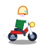
    <div style="color: #f87171; font-weight: bold; font-size: 13px; margin-top: 6px;">スクーター疾走</div>
    <div style="color: #94a3b8; font-size: 11px;">横向き（マフラー排気）</div>
  </div>

  <!-- スクーターおじさん（後ろ姿） -->
  <div style="background-color: #0f172a; border: 1px solid #ef4444; border-radius: 12px; padding: 16px; text-align: center; width: 140px;">
    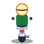
    <div style="color: #f87171; font-weight: bold; font-size: 13px; margin-top: 6px;">走り去る姿</div>
    <div style="color: #94a3b8; font-size: 11px;">北向き（テールランプ）</div>
  </div>
</div>

### 7.1. さすらいの冒険者レオン（WANDERING_ADVENTURER / 🎒）
- **外見的特徴**: 鳥の羽をあしらった緑の旅帽子、スカイブルーのマント、大荷物を詰めたリュックサック。
- **行動パターン**: 中立NPC。敵モンスターを索敵せず、マイペースに部屋内を巡回・散策。
- **対話イベント**: **「物々交換（Trade）」**
  - レオンが求めている指定カテゴリ（武器・盾・薬草・巻物・食料など）のアイテムを提示。
  - プレイヤーが手持ちのアイテムを渡すと、レオンから階層に応じた強化値付き・上位のレアアイテムが返礼として手に入ります。

### 7.2. 賭博仙人ガンジ（GAMBLER_SAGE / 🎲）
- **外見的特徴**: 胸まで伸びた豊麗な白い髭、高貴な紫色の道着、右手には金色の扇子、左手には真紅のサイコロ。
- **行動パターン**: 中立NPC。その場にどっしりと佇み、勝負師を待つ。
- **対話イベント**: **「じゃんけん勝負（Janken / Rock-Paper-Scissors）」**
  - グー（✊）・チョキ（✌️）・パー（🖐️）の3択勝負。
  - **勝利時**: プレイヤーの「持ち物の最大所持枠」が永続的に +2 枠拡張（最大24枠まで拡張可能）。
  - **あいこ時**: 勝負継続（何度でも再挑戦可能）。
  - **敗北時**: 所持金500Gを没収。ゴールドが不足している場合は、所持品の中からランダムに1つのアイテムが没収されます。

### 7.3. 慈愛の妖精ピクシー（HEALING_FAIRY / 💖）
- **外見的特徴**: 薄桃色に輝く髪、半透明の光る妖精の羽、ピンクのハートステッキ、キラキラと舞う星屑のエフェクト。
- **行動パターン**: 癒やし系モンスター。敵対せず、ふわふわと浮遊移動。
- **癒やしイベント**: **「敵味方無差別ヒーリング」**
  - プレイヤーが接触または対話すると、ハートの光とともにプレイヤーの **HPが25回復** し、**満腹度が15%** 回復します。
  - さらに、周囲に負傷した敵モンスターがいる場合、そのモンスターのHPも無差別に回復してしまう「おせっかい」な一面を持ちます。

### 7.4. さすらいの鍛冶職人バルカン（TRAVELING_BLACKSMITH / 🔨）
- **外見的特徴**: 筋骨隆々なドワーフ、立派な赤髭、煤で汚れた革のエプロン、黄金の巨大な金槌（スレッジハンマー）。
- **行動パターン**: 中立NPC。ダンジョン内の鉱脈を探しながら放浪。
- **対話イベント**: **「武具の無償強化（Free Smithing）」**
  - プレイヤーが現在装備している武器または盾を、丹念に叩いて鍛錬。
  - +1〜+2 の強化値を無償で付与してくれます（同一フロアにつき1回限定）。

### 7.5. スクーターおじさん（SCOOTER_GUY / 🛵）
- **外見的特徴**: レトロなクリーム色のヘルメット、丸メガネ、ちょび髭、緑のナイロンジャンパー、赤い原付スクーター。
- **行動パターン**: **脈絡なくダンジョンをトコトコと横断して去っていく**謎のおじさん。敵でも味方でもなく、何をするわけでもなく安全運転で走り抜けます。
- **演出＆サウンド**:
  - Web Audio APIによる単気筒4ストエンジンの排気パルス音（トコトコトコ…ブルルルン！）が近接時に響きます。
  - 話しかけると「おっと危ないよ若者！ 一時停止はちゃんと左右確認しなきゃダメだよ！」「制限速度は30km/h厳守！」など日常会話。
  - 目的地に到達すると「じゃあね〜！ 安全運転でね〜！」とクラクション（プッピー！）を鳴らして去っていきます。

---

## 8. 多種多様な名物店主たち（Shopkeepers Specification）

ダンジョン内のショップには、名作ローグライクへのリスペクトを込めた多彩な店主たちがランダムに店番として登場します。各店主には専用のビジュアル（通常姿および泥棒時の激怒姿）、専用の警告台詞、お仕置きビンタ、および個性豊かな遠隔追撃攻撃が実装されています。

<div style="display: flex; gap: 16px; flex-wrap: wrap; margin-bottom: 20px;">
  <!-- 大商人トルネー 通常 -->
  <div style="background-color: #0f172a; border: 1px solid #3b82f6; border-radius: 12px; padding: 16px; text-align: center; width: 140px;">
    
    <div style="color: #60a5fa; font-weight: bold; font-size: 13px; margin-top: 6px;">大商人トルネー</div>
    <div style="color: #94a3b8; font-size: 11px;">通常（温厚な商人）</div>
  </div>

  <!-- 大商人トルネー 激怒 -->
  <div style="background-color: #1e1111; border: 1px solid #ef4444; border-radius: 12px; padding: 16px; text-align: center; width: 140px;">
    
    <div style="color: #f87171; font-weight: bold; font-size: 13px; margin-top: 6px;">激怒トルネー</div>
    <div style="color: #ef4444; font-size: 11px;">大袋振り回し・パン投げ</div>
  </div>

  <!-- 風来坊シレンス 通常 -->
  <div style="background-color: #0f172a; border: 1px solid #0284c7; border-radius: 12px; padding: 16px; text-align: center; width: 140px;">
    
    <div style="color: #38bdf8; font-weight: bold; font-size: 13px; margin-top: 6px;">風来坊シレンス</div>
    <div style="color: #94a3b8; font-size: 11px;">通常（三度笠と相棒）</div>
  </div>

  <!-- 風来坊シレンス 激怒 -->
  <div style="background-color: #1e1111; border: 1px solid #dc2626; border-radius: 12px; padding: 16px; text-align: center; width: 140px;">
    
    <div style="color: #f87171; font-weight: bold; font-size: 13px; margin-top: 6px;">修羅シレンス</div>
    <div style="color: #dc2626; font-size: 11px;">抜刀・真空波</div>
  </div>

  <!-- 鍛冶商人ゴルド 通常 -->
  <div style="background-color: #0f172a; border: 1px solid #d97706; border-radius: 12px; padding: 16px; text-align: center; width: 140px;">
    
    <div style="color: #fbbf24; font-weight: bold; font-size: 13px; margin-top: 6px;">鍛冶商人ゴルド</div>
    <div style="color: #94a3b8; font-size: 11px;">通常（赤髭ドワーフ）</div>
  </div>

  <!-- 鍛冶商人ゴルド 激怒 -->
  <div style="background-color: #1e1111; border: 1px solid #b91c1c; border-radius: 12px; padding: 16px; text-align: center; width: 140px;">
    
    <div style="color: #f87171; font-weight: bold; font-size: 13px; margin-top: 6px;">噴火親父ゴルド</div>
    <div style="color: #b91c1c; font-size: 11px;">赤熱ハンマー・鉄塊投げ</div>
  </div>

  <!-- 魔導商人セリア 通常 -->
  <div style="background-color: #0f172a; border: 1px solid #a855f7; border-radius: 12px; padding: 16px; text-align: center; width: 140px;">
    
    <div style="color: #c084fc; font-weight: bold; font-size: 13px; margin-top: 6px;">魔導商人セリア</div>
    <div style="color: #94a3b8; font-size: 11px;">通常（エルフの魔女）</div>
  </div>

  <!-- 魔導商人セリア 激怒 -->
  <div style="background-color: #1e1111; border: 1px solid #9333ea; border-radius: 12px; padding: 16px; text-align: center; width: 140px;">
    
    <div style="color: #f87171; font-weight: bold; font-size: 13px; margin-top: 6px;">冷徹魔女セリア</div>
    <div style="color: #9333ea; font-size: 11px;">紫電魔法陣・雷撃ボルト</div>
  </div>

  <!-- 元祖商人ネロ 通常 -->
  <div style="background-color: #0f172a; border: 1px solid #eab308; border-radius: 12px; padding: 16px; text-align: center; width: 140px;">
    
    <div style="color: #facc15; font-weight: bold; font-size: 13px; margin-top: 6px;">商人ネロ</div>
    <div style="color: #94a3b8; font-size: 11px;">通常（黄色ターバン）</div>
  </div>

  <!-- 元祖商人ネロ 激怒 -->
  <div style="background-color: #1e1111; border: 1px solid #ef4444; border-radius: 12px; padding: 16px; text-align: center; width: 140px;">
    
    <div style="color: #f87171; font-weight: bold; font-size: 13px; margin-top: 6px;">怒りの店主ネロ</div>
    <div style="color: #ef4444; font-size: 11px;">逆立ち怒髪・包丁投げ</div>
  </div>
</div>

---

## 6. SVG動的カラーパレットスワップ＆色違い上位種モンスターシステム

### 6.1. パレットスワップ（Palette Swap）技術
本プロジェクトのモンスター描画はすべて**ベクターSVGデータ**（XMLテキスト）で構成されています。
そのため、追加の画像バイナリを一切ロードすることなく（ファイル容量増加ゼロ）、メモリ上でSVGコード内のHEXカラーコードを正規表現置換（カラーパレットスワップ）することにより、**12種以上の高品質な色違い・上位種モンスター（各5方向）**を動的生成・キャッシュしています。

```typescript
// SVGSprites.ts による動的カラー置換の仕組み
function replaceSvgColors(svg: string, colorMap: Record<string, string>): string {
  let result = svg;
  for (const [target, replacement] of Object.entries(colorMap)) {
    const escaped = target.replace(/[.*+?^${}()|[\]\\]/g, '\\$&');
    result = result.replace(new RegExp(escaped, 'gi'), replacement);
  }
  return result;
}
```

### 6.2. 色違い・上位種モンスター一覧
ダンジョンの深層進出に伴い、基本種に加えて以下の色違い上位種・亜種が出現します。それぞれ固有の配色・ステータス・特殊行動AIを持ちます。

| バリアントID | 名称 | 出現階層 | 基礎HP | 基礎ATK | 基礎DEF | 基礎EXP | 固有能力・行動AI |
| :--- | :--- | :--- | :---: | :---: | :---: | :---: | :--- |
| `red_slime` | **レッドスライム** | B3F〜B8F | 12 | 4 | 2 | 8 | 攻撃力・HPが通常スライムの2倍。鮮やかな赤紅色。好戦的。 |
| `metal_slime` | **メタルスライム** | 全階層（約1.5%） | 4 | 2 | 99 | 120 | **被ダメージ1固定**（会心時2）。好戦的でなくプレイヤーから素早く遠ざかる**逃走AI**。討伐時に**120 EXP**の大量経験値を獲得。 |
| `friendly_slime`| **フレンドリースライム** | 全階層（仲間専用） | 15 | 4 | 2 | 0 | 仲間モンスター専用スプライト（桜色）。頭上に💖エモートを表示。 |
| `hobgoblin` | **ホブゴブリン** | B11F〜B20F | 28 | 9 | 3 | 22 | 通常ゴブリンの約2倍の攻撃力とタフなHPを誇る前衛戦士。 |
| `goblin_shaman` | **ゴブリンシャーマン** | B14F〜B24F | 22 | 8 | 2 | 26 | **中距離遠隔魔法攻撃**（射程3マス）。闇の魔弾を直線上に発射。 |
| `poison_skeleton`| **ポイズンスケルトン** | B15F〜B28F | 32 | 11 | 4 | 32 | **【猛毒浸食】** 近接攻撃命中時、45%の確率で追加3の毒浸食ダメージを付与。 |
| `blood_skeleton` | **ブラッドスケルトン** | B25F〜B38F | 45 | 14 | 5 | 50 | **【吸血再生】** 与えたダメージの40%を自身のHPとして吸収回復。 |
| `chaos_bat` | **カオスバット** | B18F〜B32F | 26 | 9 | 3 | 24 | **【超音波乱流】** 近接攻撃命中時、40%の確率で怪音波によりプレイヤーの向きを強制転換。 |
| `wraith` | **レイス** | B22F〜B35F | 32 | 12 | 7 | 40 | 亡霊の上位種。物理防御力が極めて高く、通路で待ち伏せる。 |
| `magma_golem` | **マグマゴーレム** | B26F〜B42F | 60 | 17 | 6 | 65 | 圧倒的な高耐久とヘビーアタックを繰り出す溶岩の巨人。 |
| `blue_dragon` | **ブルードラゴン** | B32F〜B46F | 55 | 16 | 6 | 60 | レッドドラゴンの亜種。高HP・高火力の威圧感。 |
| `black_dragon` | **ブラックドラゴン** | B38F〜B49F | 70 | 20 | 7 | 80 | 最深部手前に潜む最強のドラゴン。圧倒的破壊力。 |

---

## 7. 極稀な仲良し仲間モンスターシステム（Companion System）

### 7.1. 概要と出現条件
ダンジョン探索中、**約2.5%の極稀な確率**で、プレイヤーを敵対視せず最初から仲良くしたがる**「仲間モンスター」**が自然スポーンします。
- スライムの場合は愛らしい桜色ピンクの「フレンドリースライム」となり、頭上には常時「💖」のエモートバッジが小さく脈動描画されます。
- 種族名には「人なつっこい」「心優しい」「のんびり屋の」といった愛称が冠されます（例: 「人なつっこいスライム」「心優しいゴブリン」）。

### 7.2. 通路スタック防止＆触れ合い（位置スワップ機能）
1マス幅の細い通路で仲間モンスターがプレイヤーの進路を塞いで立ち往生する事故を防ぐため、プレイヤーが仲間モンスターのいるマスへ移動入力（バンプ）した際は、**攻撃せずに両者の位置を相互に入れ替える（スワップ）**仕様となっています。
- 位置スワップ時に**なかよし度（`companionAffection`）**が+1加算されます。
- 「きゅいっ💖」「ぷにっ✨」等の愛らしい鳴き声と共になれなれしく擦り寄ってきます。
- なかよし度に応じて、プレイヤーのHPが減っている場合に**一定確率でHPを回復（+3〜6HP）**してくれる癒やし効果が発生します。

### 7.3. 勇敢な自律援護戦闘AI
仲間モンスターはプレイヤーの後ろを健気について歩くだけでなく、周囲の敵モンスターに勇敢に立ち向かいます。
1. **索敵（周囲5マス）**: 視界・索敵範囲内に敵モンスター（通常敵）を発見すると、敵モンスターへ向かって接近します。
2. **援護攻撃**: 敵と隣接すると、自身の攻撃力＋なかよし度ボーナスを加えた一撃で敵を攻撃します。
3. **経験値還元**: 仲間モンスターが敵モンスターを撃破した場合、プレイヤーに討伐経験値（EXP）が満額付与され、プレイヤーのレベルアップ契機となります。
4. **追従＆看病**: 周囲に敵がいない場合はプレイヤーへトコトコ追従し、隣接時に一定確率で看病応援（HP回復）を行います。

### 7.4. 深層フロアへの同伴（階段降下連行）
階段を降りて次のフロア（地下2階、3階……）へ進む際、フロアに生存している仲間モンスターは**一緒に階段を駆け下りて次の階層へ連れていくことができます**。
新フロア生成時、プレイヤーの開始位置の隣接マスに自動配置され、何フロアにもわたって共にダンジョン深層へ潜る相棒として冒険できます。

### 7.5. 誤爆・裏切りペナルティ
もしプレイヤーが飛び道具や攻撃で仲間モンスターを傷つけてしまった場合、なかよし度が大幅に激減（-30）します。
なかよし度が0以下になると、仲間モンスターは悲しみと怒りから敵対化（通常敵へ反転）してしまいます。


