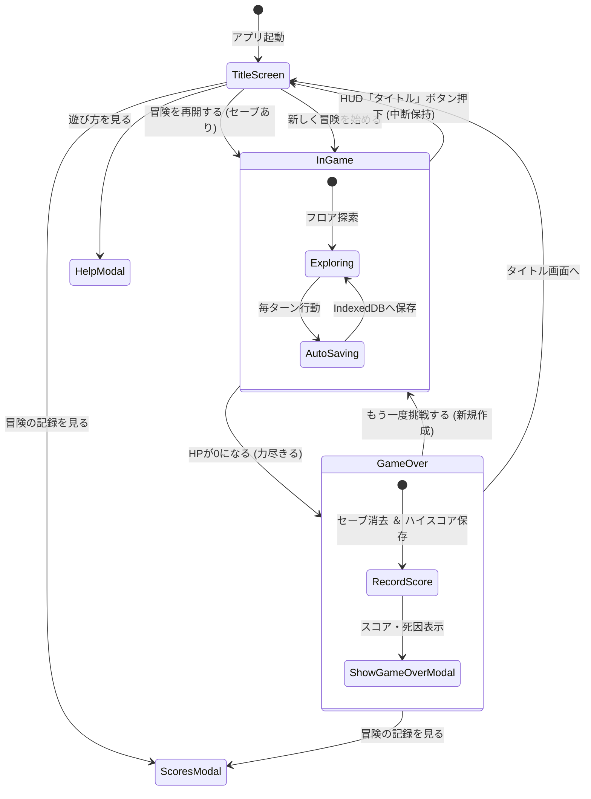

# タイトル画面＆スコア履歴設計書（Title Screen & Score History Specification）

本ドキュメントでは、ゲーム起動時に表示される**タイトル画面**、IndexedDBを活用した**過去の戦歴・スコア履歴システム**、**総合スコア算出式**、および**中断セーブデータの復元・パーマデス連携仕様**を定義します。

---

## 1. タイトル画面（Title Screen）

### ビジュアル＆UI構成
- **背景演出**: ダークファンタジー調のラジアルグラデーション（`#1e1b4b` 〜 `#0b0f19`）と、脈動する微かな光彩芒星アニメーション。
- **タイトル紋章 (SVG)**:
  - 黄金の装飾サークル、深青のヒーターシールド、交差する2本の騎士の長剣、中央に輝く紅い宝玉をインラインベクターで描画。
- **タイトルロゴ**:
  - メインタイトル: **`RogueLabyrinth`**（ゴールドグラデーションの重厚なドロップシャドウ）
  - サブタイトル: **`〜 迷宮の冒険者 〜`**

### メニューアクション
| ボタン | 識別子 | 挙動・仕様 |
|---|---|---|
| **⚔️ 冒険を再開する** | `#btn-title-continue` | IndexedDBに有効な中断セーブ（生存状態）が存在する場合のみ活性化。前回の階層・ステータス・所持品・フロアマップを完全復元して即座に探索を再開。セーブがない場合は半透明化しクリック無効（disabled）。 |
| **✨ 新しく冒険を始める** | `#btn-title-new` | 初期ステータス（地下1階、HP 20/20、薬草×1）で新規フロアを自動生成して冒険を開始。既存のセーブデータは上書き更新。 |
| **🏆 冒険の記録（スコア履歴）** | `#btn-title-scores` | 過去の冒険戦歴・ハイスコア履歴モーダルをオーバーレイ表示。 |
| **📜 遊び方・操作説明** | `#btn-title-help` | 十字キー＋4ボタンの操作表、キーボード対応、ゲームルール解説モーダルを表示。 |

---

## 2. 過去のスコア履歴システム（High Scores & History）

### 総合スコア算出式
ダンジョン探索の成果を客観的に評価するため、以下の算定式により総合スコアを算出します。

$$\text{Score} = (\text{Floor} \times 1000) + (\text{Level} \times 350) + (\text{Turn} \times 10)$$

- **到達階層ボーナス ($\times 1000$)**: 最も配点が高く、深層に到達するほど莫大なスコアを獲得。
- **冒険者レベルボーナス ($\times 350$)**: 敵を多く討伐し経験値を蓄積した成果を評価。
- **生存ターン数ボーナス ($\times 10$)**: 慎重かつ長期にわたり生き残った探索努力を評価。

### 保存データ構造 (`RunStats`)
IndexedDBの `highscores` ストアに以下の形式で永続化されます。
```typescript
export interface RunStats {
  id?: number;          // IndexedDB 自動採番キー
  floor: number;        // 到達階層 (B○F)
  level: number;        // 冒険者レベル (Lv.○)
  turn: number;         // 生存ターン数
  score: number;        // 算出された総合スコア
  causeOfDeath: string; // 冒険の結末・死因メッセージ
  timestamp: number;    // 記録日時 UNIXタイムスタンプ
}
```

### スコアランキング表示仕様
- **ソート基準**: 総合スコアの降順（同点の場合は日時の新しい順）。
- **順位バッジ演出**:
  - **1位 (🥇)**: 黄金グラデーション ＋ 光彩シャドウ（ゴールド）
  - **2位 (🥈)**: 銀白グラデーション（シルバー）
  - **3位 (🥉)**: 銅色グラデーション（ブロンズ）
  - **4位以降**: スレートバッジ（`#4` 等）
- **表示内容**:
  - 順位バッジ、総合スコア（`PTS` カンマ区切り表記）
  - グリッド表示: 到達フロア（黄）、冒険者Lv（青）、生存ターン（水色）
  - 結末/死因: 例「スライムの攻撃により力尽きた」「飢えに耐えかねて力尽きた」
  - 記録日時: 年月日および時分（`YYYY/MM/DD HH:mm`）

---

## 3. 中断セーブ・パーマデス連携フロー



- **パーマデス保証**:
  - プレイヤーのHPが0になった瞬間、中断データ用ストア（`current_run`）のデータは即時完全削除されます。
  - 同時に、到達階層・レベル・ターン・死因・計算スコアが `highscores` ストアに新レコードとして追加されます。
- **安全な中断機能**:
  - 探索中、上部HUDの「タイトル」ボタンを押すことで、現在の状態を保持したままタイトル画面へ戻ることができます。次回「冒険を再開する」から一瞬の隙もなく復帰可能です。

---

## 4. 完全オフライン & ローカル完結
- すべてのデータはブラウザの **IndexedDB (`RogueLabyrinthDB`)** にのみ保存され、外部サーバーやクラウド通信は一切発生しません。
- 飛行機内、地下鉄などの電波が届かない環境下でも、戦歴の記録・閲覧・ランキング更新がすべて完全動作します。
