# ダンジョンバイオーム＆フロア構成設計書（Biomes & Dungeon Floors Specification）

本ドキュメントでは、フロアごとの多彩なダンジョン環境（7大バイオーム / テーマ）、連続水路と木橋（Bridge）の自動生成アルゴリズム、および決定ボタン（Aボタン）による正面敵への優先攻撃・素振りシステムに関する詳細仕様を定義します。

---

## 1. 正面攻撃＆素振りシステム（Directional Attack & Slash System）

### 概要
プレイヤーが敵の方向を向いた状態で【決定ボタン】（ゲームパッドAボタン / PCキーボード: `Z`, `J`, `Enter`）を押下した際、**移動キーを押すことなくその場で即座に正面の敵へ近接攻撃**を行えるように設計されています。

また、正面に敵がおらず階段やアイテムもない場合は、シレンやトルネコシリーズにおける伝統的な**「素振り（空振り）」**が発動し、1ターン消費して敵を引き付けたりHPを回復したりする戦術的な立ち回りが可能です。

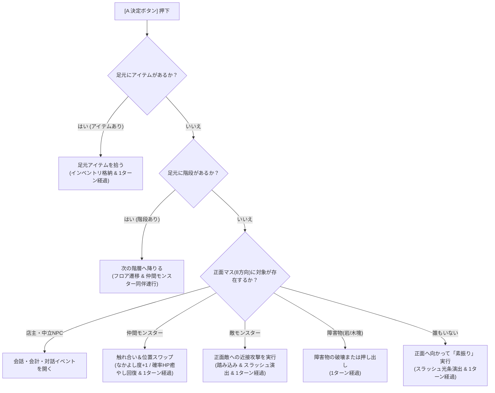

### 優先順位仕様
1. **足元アイテム拾得（最優先）**:
   - 足元の床にアイテムが存在する場合、最優先でインベントリに回収。
2. **階段降り**:
   - 足元が下り階段（`TileType.StairsDown`）の場合、次の深層フロアへ進む（生存している仲間モンスターも一緒に次フロアへ駆け下りて連行）。
3. **正面エンティティとの対話・インタラクション**:
   - **平時店主NPC**: 攻撃せず商品購入・売却会計や会話を実行。
   - **レア中立NPC**: レオン（物々交換）、ガンジ（じゃんけん）、バルカン（鍛錬）などのイベントを開く。
   - **仲良し仲間モンスター**: 攻撃せず位置を相互スワップし、なかよし度加算＆HP癒やし回復を行う。
   - **敵モンスター**: 正面敵への近接攻撃を実行（踏み込みアニメーション＋斬撃エフェクト）。
   - **障害物**: 土塊・雪塊の破壊、または大石・氷塊の押し出しを実行。
4. **素振り（ターン送り）**:
   - 足元にも正面にも何もない場合、正面に向かって武器または拳を素振り（空振り）し、1ターン経過（足踏みと同様にHP自然回復や敵の接近を誘発）。

---

## 2. 全11大ダンジョンバイオーム＆動的階層抽選（Dynamic Floor Biomes）

固定階層周期を廃止し、**ダンジョン深度（浅層・中層・深層）に応じた動的バイオーム抽選システム**を採用しています。
毎フロアごとに新鮮な環境が訪れ、壁・床の質感や環境ギミック、出現モンスターの生態系が大きく変化します。

| バイオーム種別 | 出現階層傾向 | テーマ・雰囲気 | 壁・床グラフィック | 特徴・環境ギミック | 主な出現モンスター |
| :--- | :--- | :--- | :--- | :--- | :--- |
| **`STONE`（石造りの地下迷宮）** | 浅層〜中層 | 堅牢な灰青色の古代石造迷宮 | 壁: 重厚暗黒石 床: 灰青敷石 | 均整の取れた王道ダンジョン | スライム、ゴブリン、スケルトン |
| **`EARTH`（岩と赤土の洞窟）** | 浅層〜中層 | 赤土と露出した玄武岩盤 | 壁: 漆黒火山岩 床: 赤土敷石 | 土塊・大石などの障害物が散在 | ゴブリン、岩石ゴーレム、バット |
| **`FOREST`（草木が生い茂る旧遺跡）** | 浅層〜深層 | 苔むした緑壁と古代樹の根 | 壁: 深緑巨石壁 床: 青苔敷石 | 倒木などの木製障害物が出現 | スライム、マンドラゴラ、彷徨う亡霊 |
| **`RIVER`（地下水流と木橋の清流洞）** | 中層〜深層 | 湿潤な清流と渡り木橋 | 壁: 暗青削岩壁 床: 蒼青石畳 橋: 木製桟橋 | 部屋を貫く連続水流と木製の橋 | サハギン戦士、バット、亡霊 |
| **`LAKE`（水没せし蒼玉の地下湖）** | 中層〜深層 | 神秘的な蒼碧の地下大湖 | 壁: 紺青神殿壁 床: 蒼玉モザイク | 部屋中央に広がる雄大な地底湖 | サハギン戦士、亡霊、スライム |
| **`SNOW`（白銀の雪原回廊）** | 中層〜深層 | 吹雪と積雪の白銀回廊 | 壁: 冠雪暗岩壁 床: 純白積雪石 | 雪の塊が出現・粉雪パーティクル | 彷徨う亡霊、スケルトン、ゴーレム |
| **`ICE`（永久凍土と蒼氷窟）** | 中層〜深層 | 澄み渡る蒼氷と氷晶 | 壁: 氷晶巨岩壁 床: 透光蒼氷盤 | **滑る氷床・滑る氷塊**が出現 | ダークメイジ、レッドドラゴン、ゴーレム |
| **`SWAMP`（泥濘の湿地帯）** | 中層〜深層 | 薄暗い水草と泥濘の沼地 | 壁: 暗緑湿岩壁 床: 湿地腐泥床 | **泥濘床（足を取られターン遅延）** | 腐乱ゾンビ、サハギン、マンドラゴラ |
| **`TOXIC`（腐蝕の毒沼窟）** | 中層〜最深層 | 有毒な紫泡と怪奇結晶 | 壁: 濃紫変異壁 床: 腐蝕毒泥床 | **毒沼床（踏むと2ダメージ）** | 腐乱ゾンビ、ダークメイジ、インプ |
| **`MECHA`（古代真鍮の機巧回廊）** | 中層〜最深層 | 歯車と真鍮のリベット装甲 | 壁: 歯車装甲壁 床: 螺子留め鉄板床 | 堅牢な古代文明の仕掛け回廊 | スケルトン、ゴーレム、古代ミイラ |
| **`ISLAND`（大海原の孤島迷宮）** | 中層〜最深層 | 外洋に浮かぶ孤島群 | 壁: なし（全周囲海） 床: 孤島岩礁 橋: 海峡桟橋 | **壁が一切なく全周海＋木橋で連結** | サハギン戦士、インプ、人食い箱 |

### バイオーム別タイルグラフィック一覧

  <!-- STONE -->
  

    

      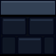
      
    

    
1. 石造迷宮

    
壁 / 床

  

  <!-- EARTH -->
  

    

      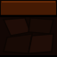
      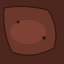
    

    
2. 赤土洞窟

    
壁 / 床

  

  <!-- FOREST -->
  

    

      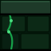
      
    

    
3. 旧遺跡

    
壁 / 床

  

  <!-- RIVER -->
  

    

      
      
    

    
4. 清流洞

    
壁 / 床

  

  <!-- LAKE -->
  

    

      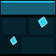
      
    

    
5. 地下大湖

    
壁 / 床

  

  <!-- SNOW -->
  

    

      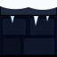
      
    

    
6. 白銀雪原

    
壁 / 床

  

  <!-- ICE -->
  

    

      
      
    

    
7. 蒼氷窟

    
壁 / 床

  

  <!-- SWAMP -->
  

    

      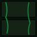
      
    

    
8. 泥濘湿地

    
壁 / 床

  

  <!-- TOXIC -->
  

    

      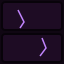
      
    

    
9. 腐蝕毒沼

    
壁 / 床

  

  <!-- MECHA -->
  

    

      
      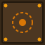
    

    
10. 機巧回廊

    
壁 / 床

  

  <!-- ISLAND -->
  

    

      
      
    

    
11. 外洋孤島

    
外洋 / 孤島

  

### 特殊環境ギミック床（Gimmick Floors）

フロア上には、キャラクターの移動や状態に直接影響を与える環境ギミック床が存在します。

  <!-- 滑る氷床 -->
  

    
    
滑る氷床

    
一直線に滑走

    
壁や障害物に当たるまで停止不能

  

  <!-- 泥濘床 -->
  

    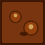
    
足枷泥濘床

    
移動ターン遅延

    
足を取られて連続行動を消費

  

  <!-- 毒沼床 -->
  

    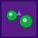
    
腐蝕毒沼床

    
2ダメージ/歩

    
踏むたびに有毒スリップダメージ

  

---

## 3. 連続水流と木橋生成アルゴリズム（River & Bridge Generation）

従来のランダムな水たまり配置を廃止し、**部屋を端から端まで貫く本物の川（連続水流）**と、その川に架けられた**通行可能な木の橋（`TileType.Bridge`）**を生成します。

### 水域と木橋タイルの性質
- **水路タイル (`TileType.Water`)**:
  - 通行不能（Passable: False）。
  - 視界は完全に透過（Transparent: True）。向こう側の敵やアイテムを視認可能。
- **木橋タイル (`TileType.Bridge`)**:
  - 通行可能（Passable: True）。プレイヤーおよびモンスターが川を渡るための通路。
  - 水流の上に厚板と鉄鋲、ロープで固定された桟橋グラフィックが描画されます。
- **到達性の数学的保証（BFS Reachability Guarantee）**:
  - ダンジョン生成後、プレイヤー開始地点から下り階段への経路を幅優先探索（BFS）で検証。
  - 水路によって部屋が分断されている場合、最短交差マスを自動で `TileType.Bridge` へ置換し、100%確実に階段へ到達できる構造を保証します。

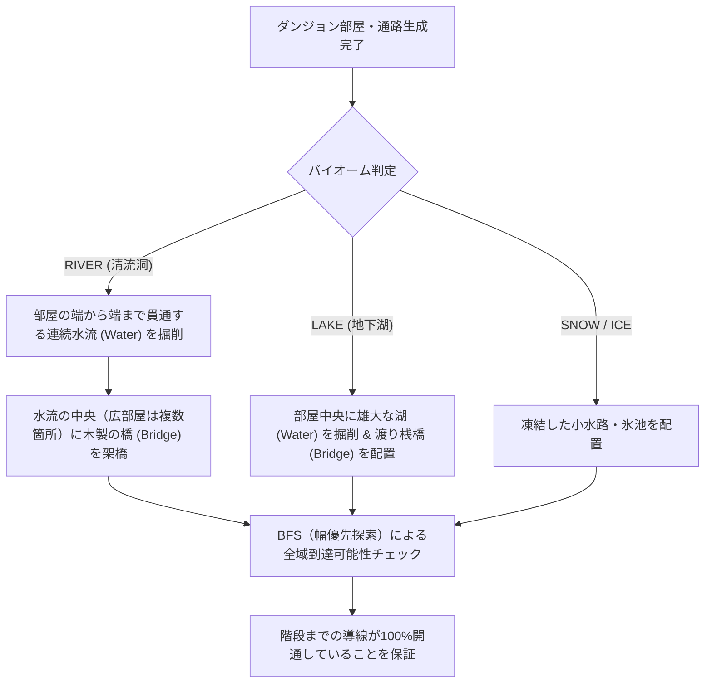

---

## 4. 環境大気パーティクル演出（Atmospheric Particles）

`CanvasRenderer` では、バイオームの雰囲気を高めるためにリアルタイムの軽量パーティクルを描画しています。

- **`SNOW`（白銀の雪原回廊）**:
  - 画面上部から優雅に舞い落ちる35粒の粉雪粒子。風の揺らぎ（サイン波ドリフト）を伴って舞い散ります。
- **`ICE`（永久凍土と蒼氷窟）**:
  - 暗闇の中にキラキラと光が瞬く25粒の氷晶・ダイヤモンドダスト。位相差による煌めきアニメーション。
- **`RIVER` & `LAKE`**:
  - 水面を走る二重サイン波のアニメーション波紋と、水光のスパークルハイライト。
