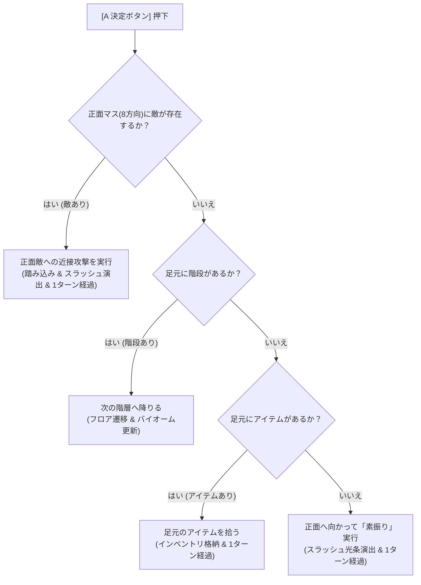
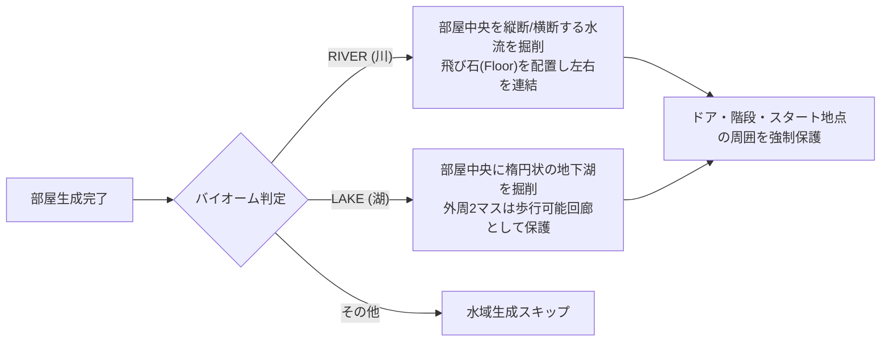

# ダンジョンバイオーム＆フロア構成設計書（Biomes & Dungeon Floors Specification）

本ドキュメントでは、フロアごとの多彩なダンジョン環境（バイオーム / テーマ）、水路・湖の自動生成アルゴリズム、および決定ボタン（Aボタン）による正面敵への優先攻撃・素振りシステムに関する詳細仕様を定義します。

---

## 1. 正面攻撃＆素振りシステム（Directional Attack & Slash System）

### 概要
プレイヤーが敵の方向を向いた状態で【決定ボタン】（ゲームパッドAボタン / PCキーボード: `Z`, `J`, `Enter`）を押下した際、**移動キーを押すことなくその場で即座に正面の敵へ近接攻撃**を行えるように設計されています。

また、正面に敵がおらず階段やアイテムもない場合は、シレンやトルネコシリーズにおける伝統的な**「素振り（空振り）」**が発動し、1ターン消費して敵を引き付けたりHPを回復したりする戦術的な立ち回りが可能です。

### 優先順位仕様
1. **正面敵への攻撃（最優先）**:
   - プレイヤーの現在向いている向き（8方向: 上、下、左、右、右上、右下、左上、左下）の直前1マスを判定。
   - 敵が存在する場合、向きを維持したまま正面の敵へ攻撃を実行（踏み込みアニメーション＋斬撃エフェクト）。
2. **階段降り**:
   - 正面に敵がおらず、プレイヤーの足元に下り階段（`TileType.StairsDown`）がある場合、次フロアへ進む。
3. **アイテム拾得**:
   - 正面に敵も階段もなく、足元に未拾得のアイテムがある場合、インベントリに回収。
4. **素振り（ターン送り）**:
   - 上記すべてに該当しない場合、正面に向かってスラッシュエフェクトを発生させ、1ターン経過（足踏みと同様にHP自然回復や敵の接近を誘発）。

---

## 2. 5大ダンジョンバイオーム（Floor Biomes）

ダンジョンは5階層（5F）周期でバイオームが切り替わり、フロアのカラーパレット、壁・床の質感、水路や湖の有無、出現モンスターの生態系が大きく変化します。

| バイオーム種別 | 階層サイクル | テーマ・雰囲気 | 壁・床カラー | 特徴・ギミック | 主な出現モンスター |
| :--- | :--- | :--- | :--- | :--- | :--- |
| **`STONE`（石の迷宮）** | B1〜B5F (B21F〜) | 堅牢な灰青色の石造迷宮 | 壁: `#334155` 床: `#1e293b` | 均整の取れた古典的ダンジョン | スライム、ゴブリン、スケルトン |
| **`EARTH`（赤土と岩盤の洞窟）** | B6〜B10F (B26F〜) | 赤褐色の土と露出した岩盤 | 壁: `#78350f` 床: `#3e2723` | ゴツゴツとした荒々しい地底空洞 | ゴブリン、岩石ゴーレム |
| **`FOREST`（草木と旧遺跡）** | B11〜B15F (B31F〜) | 苔むした緑壁と古代樹の根 | 壁: `#14532d` 床: `#064e3b` | 古代遺跡の遺構と自然の侵食 | スライム、マンドラゴラ、スケルトン |
| **`RIVER`（地下水流と清流洞）** | B16〜B20F (B36F〜) | 湿潤な青黒岩と流れる地下水 | 壁: `#1e293b` 床: `#172554` 水: `#0284c7` | 部屋を横断する地下水流・飛び石 | サハギン戦士、スケルトン、ゴーレム |
| **`LAKE`（水没せし蒼玉の地下湖）** | B21〜B25F (B41F〜) | 神秘的な蒼碧の地下大湖 | 壁: `#0e7490` 床: `#083344` 水: `#0284c7` | 部屋中央を満たす広大な地下湖水 | サハギン戦士、ゴーレム、マンドラゴラ |

---

## 3. 水路・湖畔生成アルゴリズム（Water & Lake Generation）

`DungeonGenerator.applyBiomeWater` により、バイオームが `RIVER` または `LAKE` の場合に自然な水域が生成されます。

### 水路タイル（`TileType.Water`）の性質
- **進入不可（Passable: False）**: プレイヤー・モンスターともに通常移動で進入することはできません。
- **視界透過（Transparent: True）**: 壁とは異なり視界を遮らないため、水路を挟んだ向こう側の敵やアイテムを視認できます。
- **飛び石（Stepping Stones）**: 川が部屋を分断して孤立しないよう、2〜3マス間隔で床タイル（飛び石）を自動配置。
- **孤立防止保証**:
  - 部屋の出入口（ドア・通路接続部）の周囲3×3マスは水域化を禁止。
  - プレイヤーのスタート地点および階段マスの周囲3×3マスは水域化を禁止。
  - 幅や高さが5未満の小部屋には水域を生成しない。

---

## 4. 追加モンスター＆追加アイテム

### 新モンスター
1. **岩石ゴーレム（Golem）**:
   - 主な生息地: `EARTH`（赤土の洞窟）、`RIVER`
   - HP: 35 / ATK: 12 / DEF: 5 / EXP: 30
   - 特徴: 非常に高い耐久力と重い打撃力を持つ強敵。
2. **マンドラゴラ（Mandragora）**:
   - 主な生息地: `FOREST`（草木と旧遺跡）、`LAKE`
   - HP: 18 / ATK: 7 / DEF: 2 / EXP: 14
   - 特徴: 素早い動きと不気味な叫び声で冒険者を惑わす怪植物。
3. **サハギン戦士（Sahagin）**:
   - 主な生息地: `RIVER`（地下水流）、`LAKE`（地下湖）
   - HP: 28 / ATK: 10 / DEF: 3 / EXP: 22
   - 特徴: 三叉槍を携えた水棲の戦士。水辺のフロアで群れをなして出現。

### 新アイテム＆新装備
1. **特薬草（Special Herb）**:
   - カテゴリ: `POTION`
   - 効果: HPを40大幅回復。
   - スプライト: 黄金の星とシアンのエリクサーが輝く紫硝子の薬瓶。
2. **力の種（Power Seed）**:
   - カテゴリ: `SCROLL`（消費アイテム）
   - 効果: 最大HP+3、基礎攻撃力+1を永続的に上昇。
   - スプライト: 炎の生命力を秘めたオレンジ色の古代種子。
3. **ミスリルの剣（Mithril Sword）**:
   - カテゴリ: `WEAPON`
   - 効果: 攻撃力 +8（鉄の剣の2倍の威力）。
   - スプライト: 蒼光を放つミスリル銀の刀身とサファイアの柄頭。
4. **ドラゴンの盾（Dragon Shield）**:
   - カテゴリ: `SHIELD`
   - 効果: 防御力 +6（鋼の盾の2倍の防御力）。
   - スプライト: 深紅の竜鱗と金装飾が施された伝説の盾。

---

## 5. UIおよび演出仕様

- **フロアHUD**:
  - `B1F (石の迷宮)`, `B6F (赤土と岩盤の洞窟)`, `B16F (地下水流と清流洞)` のように、現在の階層番号とバイオーム和名がリアルタイム表示されます。
- **新フロア到達トースト**:
  - 階段を降りるたびに画面中央に `B16F 【地下水流と清流洞】 に到達` と大きくトースト演出が表示されます。
- **水面のゆらめきアニメーション**:
  - `CanvasRenderer` により、水路タイル（`TileType.Water`）上にはリアルタイムの正弦波（サイン波）による水面反射・波紋エフェクトが描画されます。
- **ミニマップ対応**:
  - ミニマップ上でも水路タイルが専用のシアン・水色ドット（`#38bdf8`）で鮮明にマッピングされます。
